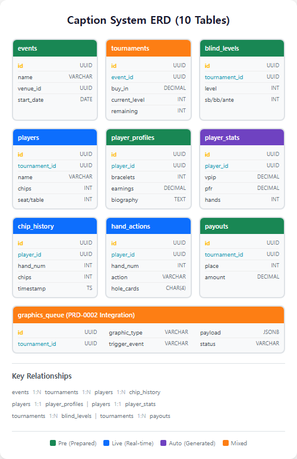

# PRD: Caption Generation Workflow System

**PRD Number**: PRD-0003
**Version**: 1.2
**Date**: 2025-12-25
**Status**: Draft
**Parent PRD**: PRD-0001 (WSOP Broadcast Graphics System), PRD-0002 (Workflow Automation System)

### Changelog
| Version | Date | Changes |
|---------|------|---------|
| 1.2 | 2025-12-26 | 섹션 3.1.1 개선 - 상호 배타적 데이터 소스 분류 체계 (중복/충돌 없음), 테이블별 소스 매핑 추가 |
| 1.1 | 2025-12-25 | 섹션 3.1.1 추가 - 데이터 수집 형태 3가지 (pokerGFX JSON, WSOP+ CSV, 수기 입력) 정의 |
| 1.0 | 2025-12-25 | Initial PRD - 26개 자막 유형별 정보 수집 체계화, DB 스키마 10개 테이블, 워크플로우 파이프라인 정의 |

### Source Documents
| Document | Location |
|----------|----------|
| PRD-0001 | [WSOP Broadcast Graphics](./0001-prd-wsop-broadcast-graphics.md) |
| PRD-0002 | [Workflow Automation](./0002-prd-workflow-automation.md) |

---

## 1. Purpose & Context

### 1.1 Background

PRD-0001에서 정의된 **26개 자막 유형**의 정보 수집 방식을 체계화하고, PRD-0002의 자동화 인프라와 통합하여 **데이터 수집 → DB 저장 → 자막 생성**의 End-to-End 파이프라인을 정의합니다.

**기존 PRD의 한계**:
- PRD-0001: 자막 디자인/기능 정의 (What) ✅
- PRD-0002: 자동화 인프라 정의 (How) ✅
- **누락**: 각 자막별 데이터 수집 방식 체계화 (Where/When) ❌

### 1.2 Goals

1. **정보 수집 체계화**: 26개 자막 유형별 Pre/Live/Auto 분류
2. **DB 스키마 통합**: 10개 핵심 테이블, 관계형 모델링
3. **워크플로우 파이프라인**: 이벤트 트리거 기반 자막 생성 자동화
4. **에이전트 역할 정의**: DataCollectionAgent, GraphicsTriggerAgent 신규 정의

### 1.3 Non-Goals

- 자막 디자인/애니메이션 (PRD-0001 담당)
- 자동화 인프라 구축 (PRD-0002 담당)
- 방송 송출 시스템 (OBS/vMix 수동 조작)

---

## 2. Caption Classification System

### 2.1 26개 자막 유형 (5개 카테고리)

| 카테고리 | 자막 수 | 주요 자막 |
|---------|--------|----------|
| **Leaderboard** | 5 | Tournament LB, Feature LB, Mini LB, Payouts, Mini Payouts |
| **Player Info** | 6 | Profile, Intro Card, At Risk, Elimination, Commentator, Heads-Up |
| **Statistics** | 5 | Chip Flow, Chip Comparison, Chips In Play, VPIP, Chip Stack Bar |
| **Event Graphics** | 5 | Schedule, Event Info, Venue, Tournament Info, Event Name |
| **Transition & L-Bar** | 5 | Blind Level, L-Bar (3종), Transition, Stinger |

### 2.2 정보 수집 방식 분류

| 수집 방식 | 코드 | 설명 | 타이밍 | 담당자 |
|----------|:----:|------|--------|--------|
| **Pre-Production** | Pre | 토너먼트 시작 전 수집 | D-7 ~ D-1 | Data Manager |
| **Live (Real-time)** | Live | RFID, 타이머, 수동 입력 | 방송 중 | RFID System, PA |
| **Auto-Generated** | Auto | 계산/집계/파생 데이터 | 실시간 | Calculation Agent |

### 2.3 자막별 데이터 매트릭스 (상세)

#### A. Leaderboard System (5개 자막)

| 자막 유형 | Pre | Live | Auto | 필요 데이터 | 핵심 테이블 | 트리거 이벤트 |
|----------|:---:|:----:|:----:|------------|------------|--------------|
| **Tournament Leaderboard** | - | O | O | chips, rank, player_id, bb_count, rank_change | players, chip_history | `hand_completed`, `level_change` |
| **Feature Table Leaderboard** | - | O | - | chips, seat, table_id, profile_photo, nationality | players, player_profiles | `feature_table_change` |
| **Mini Chip Counts** | - | O | O | chips, rank_change, highlight_flag | chip_history | `chip_update`, `pot_won` |
| **Payouts** | O | - | - | payout_structure, places_paid, total_prize | payouts | `tournament_start`, `itm_reached` |
| **Mini Payouts** | O | O | - | current_payout, next_payout, bubble_line | payouts, players | `elimination`, `pay_jump` |

#### B. Player Info System (6개 자막)

| 자막 유형 | Pre | Live | Auto | 필요 데이터 | 핵심 테이블 | 트리거 이벤트 |
|----------|:---:|:----:|:----:|------------|------------|--------------|
| **Player Profile** | O | O | - | name, nationality, photo, bracelets, earnings, current_stack | players, player_profiles | `player_featured` |
| **Player Intro Card** | O | - | - | biography, notable_wins, wsop_stats, hendon_mob_id | player_profiles | `player_intro_trigger` |
| **At Risk of Elimination** | - | O | O | current_stack, bb_count, payout_at_risk, rank | players, payouts | `all_in_detected`, `short_stack` |
| **Elimination Banner** | - | O | - | final_rank, payout_received, name, nationality | players | `player_eliminated` |
| **Commentator Profile** | O | - | - | name, photo, credentials, bio | commentators | `broadcast_start` |
| **Heads-Up Comparison** | O | O | O | stats_comparison, head2head_record, chip_ratio | player_stats, chip_history | `heads_up_trigger` |

#### C. Statistics (5개 자막)

| 자막 유형 | Pre | Live | Auto | 필요 데이터 | 핵심 테이블 | 트리거 이벤트 |
|----------|:---:|:----:|:----:|------------|------------|--------------|
| **Chip Flow** | - | O | O | chip_history[last_15], avg_stack, trend_direction | chip_history | `hand_completed` (N hands) |
| **Chip Comparison** | - | O | O | player1_chips, player2_chips, pot_equity, ratio | chip_history | `showdown_start` |
| **Chips In Play** | O | O | - | chip_denominations, total_chips_in_play | blind_levels, tournaments | `level_start`, `break_end` |
| **VPIP Stats** | - | O | O | vpip_percentage, pfr_percentage, hands_played | player_stats, hand_actions | `stat_threshold_reached` |
| **Chip Stack Bar** | - | O | O | stack_ranking, bb_equivalent, percentage_of_total | chip_history, players | `feature_table_update` |

#### D. Event Graphics (5개 자막)

| 자막 유형 | Pre | Live | Auto | 필요 데이터 | 핵심 테이블 | 트리거 이벤트 |
|----------|:---:|:----:|:----:|------------|------------|--------------|
| **Broadcast Schedule** | O | - | - | dates, times, event_names, channels | schedules | `show_schedule_trigger` |
| **Event Info** | O | O | - | buy_in, prize_pool, entries, remaining, places_paid | tournaments | `tournament_start`, `level_change` |
| **Venue/Location** | O | - | - | venue_name, city, drone_shot_url | venues | `venue_shot_trigger` |
| **Tournament Info** | O | O | - | event_name, day_number, current_level, avg_stack | tournaments, blind_levels | `day_start` |
| **Event Name Overlay** | O | - | - | event_full_name, sponsor_logos | events | `event_name_trigger` |

#### E. Transition & L-Bar (5개 자막)

| 자막 유형 | Pre | Live | Auto | 필요 데이터 | 핵심 테이블 | 트리거 이벤트 |
|----------|:---:|:----:|:----:|------------|------------|--------------|
| **Blind Level** | - | O | - | current_level, blinds, ante, duration, next_level | blind_levels | `level_change` |
| **L-Bar (Standard)** | - | O | O | blinds, seats_remaining, schedule_info, score | tournaments, blind_levels | `always_on` |
| **L-Bar (Regi Open)** | - | O | - | registration_countdown, current_entries | tournaments | `registration_open` |
| **L-Bar (Regi Close)** | - | O | - | final_entries, time_to_close | tournaments | `pre_registration_close` |
| **Transition/Stinger** | - | - | - | transition_type, player_id (optional) | - | `scene_change`, `player_highlight` |

---

## 3. Data Collection Workflow

### 3.1 전체 데이터 흐름


#### 3.1.1 상호 배타적 데이터 소스 분류

3가지 데이터 소스는 **서로 중복되거나 충돌하지 않습니다**.

| 소스 | 수집 범위 | 사용 단계 | 지연 시간 |
|------|----------|----------|----------|
| **pokerGFX JSON** | **오직 Feature Table 정보만** | Live | < 2초 |
| **WSOP+ CSV** | **오직 대회 정보 + Feature 이외 테이블만** | Live | - |
| **수기 입력** | **오직 1, 2에 해당하지 않는 정보만** | All Phases | - |

##### 소스 1: pokerGFX JSON (Feature Table 전용)

| 데이터 | 테이블 | 설명 |
|--------|--------|------|
| **칩 카운트** | `chip_history`, `players.chips` | Feature Table 플레이어만 |
| **핸드 액션** | `hand_actions` | 폴드, 콜, 레이즈, 베팅 등 |
| **홀 카드** | `hand_actions.hole_cards` | RFID로 추출된 카드 정보 |
| **팟 사이즈** | `hand_actions.pot_size_after` | 각 액션 후 팟 크기 |

##### 소스 2: WSOP+ CSV (대회 정보 + Other Tables)

| 데이터 | 테이블 | 설명 |
|--------|--------|------|
| **대회 정보** | `tournaments` | buy_in, prize_pool, registered/remaining players |
| **블라인드 레벨** | `blind_levels` | 현재 레벨, 다음 레벨, 남은 시간 |
| **페이아웃 구조** | `payouts` | 순위별 상금, 버블 라인 |
| **Other Tables 칩** | `players.chips` | Feature Table 이외 플레이어 |
| **남은 참가자 수** | `tournaments.remaining_players` | 실시간 탈락 반영 |

##### 소스 3: 수기 입력 (자동화 불가 정보)

| 데이터 | 테이블 | 담당자 |
|--------|--------|--------|
| **플레이어 프로필** | `player_profiles` | Data Manager |
| **프로필 사진** | `player_profiles.photo_url` | Data Manager |
| **바이오그래피** | `player_profiles.biography` | Data Manager |
| **좌석 배치** | `players.seat_number` | PA |
| **피처 테이블 지정** | `players.is_feature_table` | PD |
| **코멘테이터** | `commentators` | Production Team |
| **이벤트/장소** | `events`, `venues` | PD |

##### 테이블별 소스 매핑 (상호 배타적)

| 테이블 | pokerGFX JSON | WSOP+ CSV | 수기 입력 |
|--------|:-------------:|:---------:|:---------:|
| `chip_history` | **Feature만** | **Other만** | - |
| `hand_actions` | **전체** | - | - |
| `players.chips` | **Feature만** | **Other만** | - |
| `players.seat` | - | - | **전체** |
| `tournaments` | - | **전체** | - |
| `blind_levels` | - | **전체** | - |
| `payouts` | - | **전체** | - |
| `player_profiles` | - | - | **전체** |
| `commentators` | - | - | **전체** |
| `events`, `venues` | - | - | **전체** |

**핵심 원칙**: 각 데이터는 하나의 소스에서만 수집 → **충돌 불가능**

### 3.2 사전 준비 (Pre-Production)

**담당**: Data Manager
**타이밍**: D-7 ~ D-1

| 데이터 | 소스 | 수집 방법 | 저장 테이블 |
|--------|------|----------|------------|
| **Player Profiles** | Hendon Mob, WSOP.com | 크롤링 + 수동 입력 | player_profiles |
| **Payout Structure** | Tournament Director | CSV 임포트 | payouts |
| **Event/Venue Info** | Production Team | 수동 입력 | events, venues |
| **Broadcast Schedule** | PD | Google Sheets 동기화 | schedules |
| **Blind Structure** | Tournament Director | CSV 임포트 | blind_levels |
| **Commentator Profiles** | Production Team | 수동 입력 | commentators |

#### 3.2.1 Player Profile Import

```python
# Hendon Mob 크롤링 예시
class PlayerProfileImporter:
    """사전 플레이어 프로필 수집"""

    async def import_from_hendon_mob(self, player_id: str) -> PlayerProfile:
        """Hendon Mob에서 플레이어 정보 수집"""
        # 1. Hendon Mob 페이지 크롤링
        # 2. WSOP 브레이슬릿, 총 상금, 주요 성적 추출
        # 3. player_profiles 테이블에 저장
        pass

    async def import_from_csv(self, csv_path: str) -> list[PlayerProfile]:
        """CSV 배치 임포트"""
        pass
```

#### 3.2.2 Payout Structure Import

```python
# Payout 구조 임포트 예시
PAYOUT_CSV_FORMAT = """
place_start,place_end,amount,percentage
1,1,1000000,15.0
2,2,600000,9.0
3,3,400000,6.0
4,5,250000,3.75
6,9,150000,2.25
"""
```

### 3.3 실시간 수집 (Live)

**담당**: RFID System, Tournament Timer, PA
**타이밍**: 방송 중 (실시간)

| 데이터 | 소스 | 수집 방법 | 저장 테이블 | 지연 시간 |
|--------|------|----------|------------|----------|
| **Chip Counts** | RFID System | 자동 수신 | players, chip_history | < 2초 |
| **Hand Actions** | RFID System | 자동 파싱 | hand_actions | < 2초 |
| **Blind Level** | Tournament Timer | 자동 감지 | blind_levels | < 1초 |
| **Player Position** | PA (수동) | Control Panel | players | 수동 |
| **Feature Table** | PD (수동) | Control Panel | players | 수동 |

#### 3.3.1 RFID Data Flow

```python
class RFIDDataReceiver:
    """RFID 데이터 수신 및 처리"""

    async def on_hand_completed(self, rfid_data: dict):
        """핸드 완료 시 호출"""
        # 1. RFID 원시 데이터 파싱
        parsed = await self.parser.parse(rfid_data)

        # 2. hand_actions 테이블 저장
        await self.db.insert_hand_action(parsed)

        # 3. chip_history 업데이트
        await self.update_chip_history(parsed)

        # 4. player_stats 재계산 트리거
        await self.event_bus.emit('hand_completed', parsed)
```

#### 3.3.2 Tournament Timer Integration

```python
class TournamentTimer:
    """블라인드 레벨 자동 관리"""

    async def on_level_change(self, new_level: int):
        """레벨 변경 시 호출"""
        # 1. blind_levels 테이블 업데이트
        await self.db.update_current_level(new_level)

        # 2. 이벤트 발생
        await self.event_bus.emit('level_change', {
            'level': new_level,
            'blinds': self.get_blinds(new_level),
            'ante': self.get_ante(new_level)
        })
```

### 3.4 자동 생성 (Auto-Generated)

**담당**: Calculation Agent
**타이밍**: 실시간 (이벤트 트리거)

| 데이터 | 계산 방법 | 트리거 이벤트 | 저장 테이블 |
|--------|----------|--------------|------------|
| **VPIP/PFR** | hand_actions 집계 | `hand_completed` | player_stats |
| **Chip Flow** | chip_history 최근 N개 | `hand_completed` | (캐시) |
| **Rank/BB** | chips / big_blind | `chip_update` | chip_history |
| **Avg Stack %** | chips / avg_stack * 100 | `chip_update` | chip_history |
| **Payout at Risk** | 현재 순위 → payout 조회 | `all_in_detected` | (실시간 계산) |

#### 3.4.1 Stats Calculator

```python
class StatsCalculator:
    """플레이어 통계 자동 계산"""

    async def calculate_vpip(self, player_id: str) -> float:
        """VPIP 계산: 자발적 팟 참여율"""
        total_hands = await self.db.count_hands(player_id)
        voluntarily_in_pot = await self.db.count_actions(
            player_id,
            actions=['call', 'raise', 'bet']
        )
        return (voluntarily_in_pot / total_hands * 100) if total_hands > 0 else 0

    async def calculate_pfr(self, player_id: str) -> float:
        """PFR 계산: 프리플랍 레이즈율"""
        preflop_hands = await self.db.count_hands(player_id, street='preflop')
        raises = await self.db.count_actions(
            player_id,
            actions=['raise'],
            street='preflop'
        )
        return (raises / preflop_hands * 100) if preflop_hands > 0 else 0
```

#### 3.4.2 Chip Flow Generator

```python
class ChipFlowGenerator:
    """Chip Flow 차트 데이터 생성"""

    async def generate(self, player_id: str, last_n_hands: int = 15) -> list[dict]:
        """최근 N핸드 칩 히스토리 생성"""
        history = await self.db.get_chip_history(
            player_id,
            limit=last_n_hands,
            order_by='hand_number DESC'
        )

        avg_stack = await self.db.get_avg_stack()

        return [
            {
                'hand_number': h.hand_number,
                'chips': h.chips,
                'avg_percentage': (h.chips / avg_stack * 100) if avg_stack > 0 else 0,
                'trend': 'up' if h.chips_change > 0 else 'down' if h.chips_change < 0 else 'flat'
            }
            for h in reversed(history)
        ]
```

---

## 4. Database Schema

### 4.1 ERD Diagram



### 4.2 Table Definitions (10개)

#### 4.2.1 events

```sql
CREATE TABLE events (
    id UUID PRIMARY KEY DEFAULT gen_random_uuid(),
    name VARCHAR(255) NOT NULL,
    event_code VARCHAR(50) UNIQUE NOT NULL,  -- 'WSOP_2026_LV', 'WSOP_2025_SC_CYPRUS'
    venue_id UUID REFERENCES venues(id),
    start_date DATE NOT NULL,
    end_date DATE NOT NULL,
    status VARCHAR(20) DEFAULT 'scheduled',  -- 'scheduled', 'running', 'completed'
    logo_url TEXT,
    created_at TIMESTAMP DEFAULT CURRENT_TIMESTAMP,
    updated_at TIMESTAMP DEFAULT CURRENT_TIMESTAMP
);

-- 인덱스
CREATE INDEX idx_events_code ON events(event_code);
CREATE INDEX idx_events_status ON events(status);
```

#### 4.2.2 tournaments

```sql
CREATE TABLE tournaments (
    id UUID PRIMARY KEY DEFAULT gen_random_uuid(),
    event_id UUID NOT NULL REFERENCES events(id) ON DELETE CASCADE,
    name VARCHAR(255) NOT NULL,
    buy_in DECIMAL(10,2) NOT NULL,
    starting_chips INTEGER NOT NULL,
    current_level INTEGER DEFAULT 1,
    current_day INTEGER DEFAULT 1,  -- Day 1, 2, 3, Final
    registered_players INTEGER DEFAULT 0,
    remaining_players INTEGER DEFAULT 0,
    prize_pool DECIMAL(15,2) DEFAULT 0,
    bubble_line INTEGER,  -- ITM 진입 라인
    is_itm BOOLEAN DEFAULT FALSE,
    is_registration_open BOOLEAN DEFAULT TRUE,
    registration_closes_at TIMESTAMP,
    status VARCHAR(20) DEFAULT 'scheduled',  -- 'scheduled', 'running', 'paused', 'completed'
    created_at TIMESTAMP DEFAULT CURRENT_TIMESTAMP,
    updated_at TIMESTAMP DEFAULT CURRENT_TIMESTAMP
);

-- 인덱스
CREATE INDEX idx_tournaments_event ON tournaments(event_id);
CREATE INDEX idx_tournaments_status ON tournaments(status);
CREATE INDEX idx_tournaments_day ON tournaments(current_day);
```

#### 4.2.3 players

```sql
CREATE TABLE players (
    id UUID PRIMARY KEY DEFAULT gen_random_uuid(),
    tournament_id UUID NOT NULL REFERENCES tournaments(id) ON DELETE CASCADE,
    name VARCHAR(255) NOT NULL,
    nationality CHAR(2) NOT NULL,  -- ISO 3166-1 alpha-2
    photo_url TEXT,
    chips INTEGER NOT NULL DEFAULT 0,
    seat_number INTEGER,  -- 1-10
    table_number INTEGER,
    is_feature_table BOOLEAN DEFAULT FALSE,
    is_eliminated BOOLEAN DEFAULT FALSE,
    eliminated_at TIMESTAMP,
    final_rank INTEGER,
    payout_received DECIMAL(12,2),
    registration_time TIMESTAMP DEFAULT CURRENT_TIMESTAMP,
    created_at TIMESTAMP DEFAULT CURRENT_TIMESTAMP,
    updated_at TIMESTAMP DEFAULT CURRENT_TIMESTAMP
);

-- 인덱스
CREATE INDEX idx_players_tournament ON players(tournament_id);
CREATE INDEX idx_players_chips ON players(chips DESC);
CREATE INDEX idx_players_table ON players(table_number, seat_number);
CREATE INDEX idx_players_feature ON players(is_feature_table) WHERE is_feature_table = TRUE;
CREATE INDEX idx_players_eliminated ON players(is_eliminated);
```

#### 4.2.4 player_profiles

```sql
CREATE TABLE player_profiles (
    id UUID PRIMARY KEY DEFAULT gen_random_uuid(),
    player_id UUID UNIQUE NOT NULL REFERENCES players(id) ON DELETE CASCADE,
    hendon_mob_id VARCHAR(50),
    wsop_bracelets INTEGER DEFAULT 0,
    total_earnings DECIMAL(15,2) DEFAULT 0,
    final_tables INTEGER DEFAULT 0,
    biography TEXT,
    notable_wins JSONB DEFAULT '[]',  -- [{"event": "...", "year": 2023, "prize": 1000000}]
    hometown VARCHAR(255),
    age INTEGER,
    profession VARCHAR(255),
    social_links JSONB DEFAULT '{}',  -- {"twitter": "...", "instagram": "..."}
    created_at TIMESTAMP DEFAULT CURRENT_TIMESTAMP,
    updated_at TIMESTAMP DEFAULT CURRENT_TIMESTAMP
);

-- 인덱스
CREATE INDEX idx_profiles_hendon ON player_profiles(hendon_mob_id);
CREATE INDEX idx_profiles_bracelets ON player_profiles(wsop_bracelets DESC);
CREATE INDEX idx_profiles_earnings ON player_profiles(total_earnings DESC);
```

#### 4.2.5 player_stats

```sql
CREATE TABLE player_stats (
    id UUID PRIMARY KEY DEFAULT gen_random_uuid(),
    player_id UUID NOT NULL REFERENCES players(id) ON DELETE CASCADE,
    tournament_id UUID NOT NULL REFERENCES tournaments(id) ON DELETE CASCADE,
    hands_played INTEGER DEFAULT 0,
    vpip DECIMAL(5,2) DEFAULT 0,  -- Voluntarily Put $ In Pot (0-100%)
    pfr DECIMAL(5,2) DEFAULT 0,   -- Pre-Flop Raise (0-100%)
    aggression_factor DECIMAL(5,2),  -- (Bet + Raise) / Call
    showdown_win_rate DECIMAL(5,2),
    three_bet_percentage DECIMAL(5,2),
    fold_to_three_bet DECIMAL(5,2),
    last_calculated_at TIMESTAMP DEFAULT CURRENT_TIMESTAMP,

    UNIQUE(player_id, tournament_id)
);

-- 인덱스
CREATE INDEX idx_stats_player ON player_stats(player_id);
CREATE INDEX idx_stats_vpip ON player_stats(vpip);
CREATE INDEX idx_stats_pfr ON player_stats(pfr);
```

#### 4.2.6 chip_history

```sql
CREATE TABLE chip_history (
    id UUID PRIMARY KEY DEFAULT gen_random_uuid(),
    player_id UUID NOT NULL REFERENCES players(id) ON DELETE CASCADE,
    tournament_id UUID NOT NULL REFERENCES tournaments(id) ON DELETE CASCADE,
    hand_number INTEGER NOT NULL,
    level_number INTEGER NOT NULL,
    chips INTEGER NOT NULL,
    chips_change INTEGER DEFAULT 0,  -- +/- from previous hand
    bb_count DECIMAL(10,2),  -- chips / big_blind
    avg_stack_percentage DECIMAL(6,2),  -- chips / avg_stack * 100
    source VARCHAR(20) DEFAULT 'rfid',  -- 'rfid', 'manual', 'calculated'
    timestamp TIMESTAMP DEFAULT CURRENT_TIMESTAMP
);

-- 인덱스
CREATE INDEX idx_chip_history_player ON chip_history(player_id);
CREATE INDEX idx_chip_history_tournament ON chip_history(tournament_id);
CREATE INDEX idx_chip_history_hand ON chip_history(hand_number DESC);
CREATE INDEX idx_chip_history_timestamp ON chip_history(timestamp DESC);

-- 파티셔닝 고려 (대용량 데이터)
-- CREATE TABLE chip_history_partitioned (
--     ...
-- ) PARTITION BY RANGE (timestamp);
```

#### 4.2.7 hand_actions

```sql
CREATE TABLE hand_actions (
    id UUID PRIMARY KEY DEFAULT gen_random_uuid(),
    tournament_id UUID NOT NULL REFERENCES tournaments(id) ON DELETE CASCADE,
    table_number INTEGER NOT NULL,
    hand_number INTEGER NOT NULL,
    player_id UUID NOT NULL REFERENCES players(id) ON DELETE CASCADE,
    position INTEGER NOT NULL,  -- 1-10 (seat position)
    hole_cards CHAR(4),  -- 'AhKs', 'QdQc' (RFID로 추출)
    street VARCHAR(10) NOT NULL,  -- 'preflop', 'flop', 'turn', 'river'
    action VARCHAR(20) NOT NULL,  -- 'fold', 'call', 'raise', 'check', 'bet', 'all-in'
    bet_amount DECIMAL(12,2),
    pot_size_after DECIMAL(12,2),
    is_winner BOOLEAN DEFAULT FALSE,
    timestamp TIMESTAMP DEFAULT CURRENT_TIMESTAMP
);

-- 인덱스
CREATE INDEX idx_actions_tournament ON hand_actions(tournament_id);
CREATE INDEX idx_actions_player ON hand_actions(player_id);
CREATE INDEX idx_actions_hand ON hand_actions(hand_number);
CREATE INDEX idx_actions_street ON hand_actions(street);
CREATE INDEX idx_actions_action ON hand_actions(action);
```

#### 4.2.8 payouts

```sql
CREATE TABLE payouts (
    id UUID PRIMARY KEY DEFAULT gen_random_uuid(),
    tournament_id UUID NOT NULL REFERENCES tournaments(id) ON DELETE CASCADE,
    place_start INTEGER NOT NULL,  -- 1, 2, 3, 4 (for 4-5), 6 (for 6-9), ...
    place_end INTEGER NOT NULL,    -- 1, 2, 3, 5, 9, ...
    amount DECIMAL(12,2) NOT NULL,
    percentage DECIMAL(5,2),  -- of total prize pool
    is_current_bubble BOOLEAN DEFAULT FALSE,  -- 현재 버블 라인
    created_at TIMESTAMP DEFAULT CURRENT_TIMESTAMP
);

-- 인덱스
CREATE INDEX idx_payouts_tournament ON payouts(tournament_id);
CREATE INDEX idx_payouts_place ON payouts(place_start, place_end);
CREATE UNIQUE INDEX idx_payouts_unique ON payouts(tournament_id, place_start, place_end);
```

#### 4.2.9 blind_levels

```sql
CREATE TABLE blind_levels (
    id UUID PRIMARY KEY DEFAULT gen_random_uuid(),
    tournament_id UUID NOT NULL REFERENCES tournaments(id) ON DELETE CASCADE,
    level_number INTEGER NOT NULL,
    small_blind INTEGER NOT NULL,
    big_blind INTEGER NOT NULL,
    ante INTEGER DEFAULT 0,
    big_blind_ante INTEGER DEFAULT 0,  -- BBA (Big Blind Ante)
    duration_minutes INTEGER NOT NULL,
    is_break BOOLEAN DEFAULT FALSE,
    break_duration_minutes INTEGER,
    is_current BOOLEAN DEFAULT FALSE,
    started_at TIMESTAMP,
    ends_at TIMESTAMP,
    created_at TIMESTAMP DEFAULT CURRENT_TIMESTAMP,

    UNIQUE(tournament_id, level_number)
);

-- 인덱스
CREATE INDEX idx_blinds_tournament ON blind_levels(tournament_id);
CREATE INDEX idx_blinds_level ON blind_levels(level_number);
CREATE INDEX idx_blinds_current ON blind_levels(is_current) WHERE is_current = TRUE;
```

#### 4.2.10 graphics_queue

```sql
CREATE TABLE graphics_queue (
    id UUID PRIMARY KEY DEFAULT gen_random_uuid(),
    tournament_id UUID REFERENCES tournaments(id) ON DELETE SET NULL,
    graphic_type VARCHAR(50) NOT NULL,  -- 'tournament_leaderboard', 'chip_flow', 'at_risk', ...
    trigger_event VARCHAR(50) NOT NULL,  -- 'level_change', 'elimination', 'hand_completed', ...
    payload JSONB NOT NULL DEFAULT '{}',  -- 자막 렌더링에 필요한 데이터
    priority INTEGER DEFAULT 5,  -- 1 (highest) - 10 (lowest)
    status VARCHAR(20) DEFAULT 'pending',  -- 'pending', 'rendering', 'rendered', 'displayed', 'dismissed', 'failed'
    error_message TEXT,
    created_at TIMESTAMP DEFAULT CURRENT_TIMESTAMP,
    rendered_at TIMESTAMP,
    displayed_at TIMESTAMP,
    dismissed_at TIMESTAMP
);

-- 인덱스
CREATE INDEX idx_queue_tournament ON graphics_queue(tournament_id);
CREATE INDEX idx_queue_status ON graphics_queue(status);
CREATE INDEX idx_queue_priority ON graphics_queue(priority);
CREATE INDEX idx_queue_created ON graphics_queue(created_at DESC);
CREATE INDEX idx_queue_pending ON graphics_queue(status, priority, created_at)
    WHERE status = 'pending';
```

### 4.3 SQL Migration Script

```sql
-- Migration: 001_create_caption_tables.sql
-- Description: PRD-0003 자막 시스템 테이블 생성
-- Author: Claude Code
-- Date: 2025-12-25

BEGIN;

-- 1. venues (참조용, 간단)
CREATE TABLE IF NOT EXISTS venues (
    id UUID PRIMARY KEY DEFAULT gen_random_uuid(),
    name VARCHAR(255) NOT NULL,
    city VARCHAR(100),
    country CHAR(2),
    address TEXT,
    drone_shot_url TEXT,
    created_at TIMESTAMP DEFAULT CURRENT_TIMESTAMP
);

-- 2. events
CREATE TABLE IF NOT EXISTS events (
    id UUID PRIMARY KEY DEFAULT gen_random_uuid(),
    name VARCHAR(255) NOT NULL,
    event_code VARCHAR(50) UNIQUE NOT NULL,
    venue_id UUID REFERENCES venues(id),
    start_date DATE NOT NULL,
    end_date DATE NOT NULL,
    status VARCHAR(20) DEFAULT 'scheduled',
    logo_url TEXT,
    created_at TIMESTAMP DEFAULT CURRENT_TIMESTAMP,
    updated_at TIMESTAMP DEFAULT CURRENT_TIMESTAMP
);

-- 3. tournaments
CREATE TABLE IF NOT EXISTS tournaments (
    id UUID PRIMARY KEY DEFAULT gen_random_uuid(),
    event_id UUID NOT NULL REFERENCES events(id) ON DELETE CASCADE,
    name VARCHAR(255) NOT NULL,
    buy_in DECIMAL(10,2) NOT NULL,
    starting_chips INTEGER NOT NULL,
    current_level INTEGER DEFAULT 1,
    current_day INTEGER DEFAULT 1,
    registered_players INTEGER DEFAULT 0,
    remaining_players INTEGER DEFAULT 0,
    prize_pool DECIMAL(15,2) DEFAULT 0,
    bubble_line INTEGER,
    is_itm BOOLEAN DEFAULT FALSE,
    is_registration_open BOOLEAN DEFAULT TRUE,
    registration_closes_at TIMESTAMP,
    status VARCHAR(20) DEFAULT 'scheduled',
    created_at TIMESTAMP DEFAULT CURRENT_TIMESTAMP,
    updated_at TIMESTAMP DEFAULT CURRENT_TIMESTAMP
);

-- 4. players
CREATE TABLE IF NOT EXISTS players (
    id UUID PRIMARY KEY DEFAULT gen_random_uuid(),
    tournament_id UUID NOT NULL REFERENCES tournaments(id) ON DELETE CASCADE,
    name VARCHAR(255) NOT NULL,
    nationality CHAR(2) NOT NULL,
    photo_url TEXT,
    chips INTEGER NOT NULL DEFAULT 0,
    seat_number INTEGER,
    table_number INTEGER,
    is_feature_table BOOLEAN DEFAULT FALSE,
    is_eliminated BOOLEAN DEFAULT FALSE,
    eliminated_at TIMESTAMP,
    final_rank INTEGER,
    payout_received DECIMAL(12,2),
    registration_time TIMESTAMP DEFAULT CURRENT_TIMESTAMP,
    created_at TIMESTAMP DEFAULT CURRENT_TIMESTAMP,
    updated_at TIMESTAMP DEFAULT CURRENT_TIMESTAMP
);

-- 5. player_profiles
CREATE TABLE IF NOT EXISTS player_profiles (
    id UUID PRIMARY KEY DEFAULT gen_random_uuid(),
    player_id UUID UNIQUE NOT NULL REFERENCES players(id) ON DELETE CASCADE,
    hendon_mob_id VARCHAR(50),
    wsop_bracelets INTEGER DEFAULT 0,
    total_earnings DECIMAL(15,2) DEFAULT 0,
    final_tables INTEGER DEFAULT 0,
    biography TEXT,
    notable_wins JSONB DEFAULT '[]',
    hometown VARCHAR(255),
    age INTEGER,
    profession VARCHAR(255),
    social_links JSONB DEFAULT '{}',
    created_at TIMESTAMP DEFAULT CURRENT_TIMESTAMP,
    updated_at TIMESTAMP DEFAULT CURRENT_TIMESTAMP
);

-- 6. player_stats
CREATE TABLE IF NOT EXISTS player_stats (
    id UUID PRIMARY KEY DEFAULT gen_random_uuid(),
    player_id UUID NOT NULL REFERENCES players(id) ON DELETE CASCADE,
    tournament_id UUID NOT NULL REFERENCES tournaments(id) ON DELETE CASCADE,
    hands_played INTEGER DEFAULT 0,
    vpip DECIMAL(5,2) DEFAULT 0,
    pfr DECIMAL(5,2) DEFAULT 0,
    aggression_factor DECIMAL(5,2),
    showdown_win_rate DECIMAL(5,2),
    three_bet_percentage DECIMAL(5,2),
    fold_to_three_bet DECIMAL(5,2),
    last_calculated_at TIMESTAMP DEFAULT CURRENT_TIMESTAMP,
    UNIQUE(player_id, tournament_id)
);

-- 7. chip_history
CREATE TABLE IF NOT EXISTS chip_history (
    id UUID PRIMARY KEY DEFAULT gen_random_uuid(),
    player_id UUID NOT NULL REFERENCES players(id) ON DELETE CASCADE,
    tournament_id UUID NOT NULL REFERENCES tournaments(id) ON DELETE CASCADE,
    hand_number INTEGER NOT NULL,
    level_number INTEGER NOT NULL,
    chips INTEGER NOT NULL,
    chips_change INTEGER DEFAULT 0,
    bb_count DECIMAL(10,2),
    avg_stack_percentage DECIMAL(6,2),
    source VARCHAR(20) DEFAULT 'rfid',
    timestamp TIMESTAMP DEFAULT CURRENT_TIMESTAMP
);

-- 8. hand_actions
CREATE TABLE IF NOT EXISTS hand_actions (
    id UUID PRIMARY KEY DEFAULT gen_random_uuid(),
    tournament_id UUID NOT NULL REFERENCES tournaments(id) ON DELETE CASCADE,
    table_number INTEGER NOT NULL,
    hand_number INTEGER NOT NULL,
    player_id UUID NOT NULL REFERENCES players(id) ON DELETE CASCADE,
    position INTEGER NOT NULL,
    hole_cards CHAR(4),
    street VARCHAR(10) NOT NULL,
    action VARCHAR(20) NOT NULL,
    bet_amount DECIMAL(12,2),
    pot_size_after DECIMAL(12,2),
    is_winner BOOLEAN DEFAULT FALSE,
    timestamp TIMESTAMP DEFAULT CURRENT_TIMESTAMP
);

-- 9. payouts
CREATE TABLE IF NOT EXISTS payouts (
    id UUID PRIMARY KEY DEFAULT gen_random_uuid(),
    tournament_id UUID NOT NULL REFERENCES tournaments(id) ON DELETE CASCADE,
    place_start INTEGER NOT NULL,
    place_end INTEGER NOT NULL,
    amount DECIMAL(12,2) NOT NULL,
    percentage DECIMAL(5,2),
    is_current_bubble BOOLEAN DEFAULT FALSE,
    created_at TIMESTAMP DEFAULT CURRENT_TIMESTAMP,
    UNIQUE(tournament_id, place_start, place_end)
);

-- 10. blind_levels
CREATE TABLE IF NOT EXISTS blind_levels (
    id UUID PRIMARY KEY DEFAULT gen_random_uuid(),
    tournament_id UUID NOT NULL REFERENCES tournaments(id) ON DELETE CASCADE,
    level_number INTEGER NOT NULL,
    small_blind INTEGER NOT NULL,
    big_blind INTEGER NOT NULL,
    ante INTEGER DEFAULT 0,
    big_blind_ante INTEGER DEFAULT 0,
    duration_minutes INTEGER NOT NULL,
    is_break BOOLEAN DEFAULT FALSE,
    break_duration_minutes INTEGER,
    is_current BOOLEAN DEFAULT FALSE,
    started_at TIMESTAMP,
    ends_at TIMESTAMP,
    created_at TIMESTAMP DEFAULT CURRENT_TIMESTAMP,
    UNIQUE(tournament_id, level_number)
);

-- 11. graphics_queue
CREATE TABLE IF NOT EXISTS graphics_queue (
    id UUID PRIMARY KEY DEFAULT gen_random_uuid(),
    tournament_id UUID REFERENCES tournaments(id) ON DELETE SET NULL,
    graphic_type VARCHAR(50) NOT NULL,
    trigger_event VARCHAR(50) NOT NULL,
    payload JSONB NOT NULL DEFAULT '{}',
    priority INTEGER DEFAULT 5,
    status VARCHAR(20) DEFAULT 'pending',
    error_message TEXT,
    created_at TIMESTAMP DEFAULT CURRENT_TIMESTAMP,
    rendered_at TIMESTAMP,
    displayed_at TIMESTAMP,
    dismissed_at TIMESTAMP
);

-- 12. commentators (추가)
CREATE TABLE IF NOT EXISTS commentators (
    id UUID PRIMARY KEY DEFAULT gen_random_uuid(),
    name VARCHAR(255) NOT NULL,
    photo_url TEXT,
    credentials TEXT,
    biography TEXT,
    social_links JSONB DEFAULT '{}',
    is_active BOOLEAN DEFAULT TRUE,
    created_at TIMESTAMP DEFAULT CURRENT_TIMESTAMP
);

-- 13. schedules (추가)
CREATE TABLE IF NOT EXISTS schedules (
    id UUID PRIMARY KEY DEFAULT gen_random_uuid(),
    event_id UUID REFERENCES events(id) ON DELETE CASCADE,
    date DATE NOT NULL,
    time_start TIME NOT NULL,
    time_end TIME,
    event_name VARCHAR(255) NOT NULL,
    channel VARCHAR(100),
    is_live BOOLEAN DEFAULT FALSE,
    created_at TIMESTAMP DEFAULT CURRENT_TIMESTAMP
);

-- 인덱스 생성 (성능 최적화)
CREATE INDEX IF NOT EXISTS idx_events_code ON events(event_code);
CREATE INDEX IF NOT EXISTS idx_tournaments_event ON tournaments(event_id);
CREATE INDEX IF NOT EXISTS idx_tournaments_status ON tournaments(status);
CREATE INDEX IF NOT EXISTS idx_players_tournament ON players(tournament_id);
CREATE INDEX IF NOT EXISTS idx_players_chips ON players(chips DESC);
CREATE INDEX IF NOT EXISTS idx_players_table ON players(table_number, seat_number);
CREATE INDEX IF NOT EXISTS idx_chip_history_player ON chip_history(player_id);
CREATE INDEX IF NOT EXISTS idx_chip_history_hand ON chip_history(hand_number DESC);
CREATE INDEX IF NOT EXISTS idx_actions_player ON hand_actions(player_id);
CREATE INDEX IF NOT EXISTS idx_actions_hand ON hand_actions(hand_number);
CREATE INDEX IF NOT EXISTS idx_payouts_tournament ON payouts(tournament_id);
CREATE INDEX IF NOT EXISTS idx_blinds_tournament ON blind_levels(tournament_id);
CREATE INDEX IF NOT EXISTS idx_queue_status ON graphics_queue(status);
CREATE INDEX IF NOT EXISTS idx_queue_priority ON graphics_queue(priority);

COMMIT;
```

### 4.4 Index & Performance Considerations

| 테이블 | 쿼리 패턴 | 인덱스 전략 |
|--------|----------|------------|
| **chip_history** | 최근 N핸드 조회 | `(player_id, hand_number DESC)` 복합 인덱스 |
| **hand_actions** | 특정 핸드의 모든 액션 | `(hand_number, timestamp)` 복합 인덱스 |
| **players** | 칩 순위 조회 | `(chips DESC)` 내림차순 인덱스 |
| **graphics_queue** | 대기 중 그래픽 조회 | `(status, priority, created_at)` 부분 인덱스 |

**대용량 데이터 고려**:
- `chip_history`: 파티셔닝 고려 (날짜별/토너먼트별)
- `hand_actions`: 30일 이상 데이터 아카이브
- 읽기 복제본: 그래픽 렌더링 쿼리 분산

---

## 5. Workflow Pipeline

### 5.1 Agent Hierarchy


### 5.2 Agent Definitions

#### 5.2.1 DataCollectionAgent (신규)

```python
class DataCollectionAgent(BaseAgent):
    """PRD-0003: 데이터 수집 통합 에이전트"""

    def __init__(self, config: AgentConfig, event_bus, db_session):
        super().__init__(config, event_bus, db_session)
        self.pre_production_agent = PreProductionAgent(...)
        self.live_data_agent = LiveDataAgent(...)
        self.auto_generator_agent = AutoGeneratorAgent(...)

    async def initialize(self):
        """하위 에이전트 초기화"""
        await self.pre_production_agent.initialize()
        await self.live_data_agent.initialize()
        await self.auto_generator_agent.initialize()

    async def process(self, event):
        """이벤트 라우팅"""
        if event.type.startswith('pre_production.'):
            return await self.pre_production_agent.process(event)
        elif event.type.startswith('live.'):
            return await self.live_data_agent.process(event)
        elif event.type.startswith('auto.'):
            return await self.auto_generator_agent.process(event)
```

#### 5.2.2 GraphicsTriggerAgent (신규)

```python
class GraphicsTriggerAgent(BaseAgent):
    """PRD-0003: 그래픽 트리거 에이전트"""

    def __init__(self, config: AgentConfig, event_bus, db_session):
        super().__init__(config, event_bus, db_session)
        self.event_listener = EventListenerAgent(...)
        self.priority_decision = PriorityDecisionAgent(...)
        self.queue_manager = QueueManagerAgent(...)

    async def on_event(self, event: WorkflowEvent):
        """이벤트 수신 시 그래픽 트리거 결정"""
        # 1. 이벤트-그래픽 매핑 조회
        graphics = self.get_triggered_graphics(event)

        # 2. 우선순위 결정 (AI 기반)
        prioritized = await self.priority_decision.decide(graphics, event)

        # 3. 큐에 추가
        for graphic in prioritized:
            await self.queue_manager.enqueue(graphic)

    def get_triggered_graphics(self, event: WorkflowEvent) -> list[str]:
        """이벤트에 따른 트리거 그래픽 반환"""
        mapping = {
            'hand_completed': ['chip_flow', 'mini_chip_counts', 'tournament_leaderboard'],
            'level_change': ['blind_level', 'l_bar', 'tournament_leaderboard'],
            'player_eliminated': ['elimination_banner', 'mini_payouts', 'tournament_leaderboard'],
            'all_in_detected': ['at_risk', 'chip_comparison'],
            'feature_table_change': ['feature_leaderboard', 'player_profile'],
            'itm_reached': ['payouts', 'tournament_info'],
            'day_start': ['event_info', 'tournament_info', 'broadcast_schedule'],
            'break_end': ['chips_in_play', 'blind_level'],
        }
        return mapping.get(event.type, [])
```

### 5.3 Event Trigger Mapping (8개 핵심 이벤트)

| # | 이벤트 | 발생 시점 | 트리거 자막 | 우선순위 |
|---|--------|----------|------------|----------|
| 1 | `hand_completed` | 핸드 종료 | Chip Flow, Mini Chip Counts, Tournament LB | Medium |
| 2 | `level_change` | 레벨 변경 | Blind Level, L-Bar, Tournament LB | High |
| 3 | `player_eliminated` | 플레이어 탈락 | Elimination Banner, Mini Payouts, Tournament LB | High |
| 4 | `all_in_detected` | 올인 감지 | At Risk, Chip Comparison | High |
| 5 | `feature_table_change` | 피처 테이블 변경 | Feature LB, Player Profile | Medium |
| 6 | `itm_reached` | ITM 진입 | Payouts, Tournament Info | High |
| 7 | `day_start` | Day 시작 | Event Info, Tournament Info, Schedule | Low |
| 8 | `break_end` | 브레이크 종료 | Chips In Play, Blind Level | Medium |

### 5.4 Event Type Definitions

```python
from enum import Enum

class CaptionEventType(Enum):
    # Data Collection Events
    PRE_PRODUCTION_PLAYER_IMPORTED = "pre_production.player.imported"
    PRE_PRODUCTION_PAYOUT_IMPORTED = "pre_production.payout.imported"
    PRE_PRODUCTION_SCHEDULE_UPDATED = "pre_production.schedule.updated"

    # Live Events (RFID/Timer)
    LIVE_HAND_COMPLETED = "live.hand.completed"
    LIVE_LEVEL_CHANGE = "live.level.changed"
    LIVE_PLAYER_ELIMINATED = "live.player.eliminated"
    LIVE_ALL_IN_DETECTED = "live.all_in.detected"
    LIVE_FEATURE_TABLE_CHANGE = "live.feature_table.changed"
    LIVE_ITM_REACHED = "live.itm.reached"
    LIVE_DAY_START = "live.day.started"
    LIVE_BREAK_END = "live.break.ended"
    LIVE_REGISTRATION_CLOSED = "live.registration.closed"

    # Auto-Generated Events
    AUTO_STATS_CALCULATED = "auto.stats.calculated"
    AUTO_CHIP_FLOW_GENERATED = "auto.chip_flow.generated"
    AUTO_RANK_UPDATED = "auto.rank.updated"

    # Graphics Events
    GRAPHICS_TRIGGERED = "graphics.triggered"
    GRAPHICS_RENDERED = "graphics.rendered"
    GRAPHICS_DISPLAYED = "graphics.displayed"
    GRAPHICS_DISMISSED = "graphics.dismissed"
```

---

## 6. PRD-0001/0002 Integration

### 6.1 공유 인프라

| 인프라 | PRD-0001 | PRD-0002 | PRD-0003 |
|--------|----------|----------|----------|
| **PostgreSQL** | 스키마 정의 | 이벤트 로그 | 10개 자막 테이블 |
| **Google Sheets** | 읽기 (렌더링) | 양방향 동기화 | 사전 데이터 임포트 |
| **WebSocket** | 그래픽 UI | 모니터링 | 실시간 데이터 푸시 |
| **Redis** | 세션/캐시 | Event Bus | Chip Flow 캐시 |
| **Event Bus** | - | 정의 | 8개 이벤트 추가 |

### 6.2 의존성 그래프

```
PRD-0003 (Caption Workflow)
    │
    ├──── PRD-0002 (Automation)
    │     ├── Event Bus System
    │     ├── DataSyncAgent (RFID Parser)
    │     ├── MonitoringAgent
    │     └── AI Agent Framework
    │
    └──── PRD-0001 (Graphics)
          ├── 26개 자막 컴포넌트
          ├── Control Panel
          ├── OBS Integration
          └── Animation System
```

### 6.3 데이터 흐름 통합

```
RFID System (현장)
    │
    ▼
PRD-0002: RFIDParserAgent
    │
    ▼
PRD-0003: DataCollectionAgent ───────────────┐
    │                                         │
    ├── LiveDataAgent ─────────────┐          │
    ├── AutoGeneratorAgent ────────┤          │
    └── PreProductionAgent ────────┤          │
                                   │          │
                                   ▼          ▼
                           PostgreSQL (10 Tables)
                                   │
                                   ▼
PRD-0003: GraphicsTriggerAgent
    │
    ├── EventListenerAgent
    ├── PriorityDecisionAgent (AI)
    └── QueueManagerAgent
                   │
                   ▼
           graphics_queue
                   │
                   ▼
PRD-0001: Graphics Frontend (React)
                   │
                   ▼
           OBS Browser Source
```

---

## 7. Implementation Phases

### Phase 0: Infrastructure Extension (1주)

| 작업 | 설명 | 산출물 | 의존성 |
|------|------|--------|--------|
| DB 마이그레이션 | 10개 테이블 생성 | `001_create_caption_tables.sql` | PRD-0001 Phase 1 |
| 이벤트 타입 정의 | 8개 핵심 이벤트 | `caption_events.py` | PRD-0002 Phase 0 |
| Agent 인터페이스 | DataCollectionAgent, GraphicsTriggerAgent | `agents/caption/` | PRD-0002 |

### Phase 1: Pre-Production Pipeline (2주)

| 작업 | 설명 | 우선순위 |
|------|------|----------|
| PreProductionAgent 구현 | Hendon Mob 크롤링, 수동 입력 UI | P0 |
| Player Profile Import | 배치 임포트, 이미지 다운로드 | P0 |
| Payout Structure Import | CSV 임포트, 수동 편집 | P0 |
| Event/Venue Setup | 토너먼트 기본 정보 입력 | P0 |
| Blind Structure Import | CSV 임포트 | P1 |

### Phase 2: Live Data Pipeline (3주)

| 작업 | 설명 | 우선순위 |
|------|------|----------|
| LiveDataAgent 구현 | RFID 데이터 수신/파싱 | P0 |
| ChipHistoryTracker | 칩 변동 자동 기록 | P0 |
| BlindLevelTimer | 레벨 자동 전환, 이벤트 발생 | P0 |
| FeatureTableManager | 피처 테이블 플레이어 관리 | P1 |
| Manual Input UI | PA용 수동 입력 인터페이스 | P1 |

### Phase 3: Auto-Generation Pipeline (2주)

| 작업 | 설명 | 우선순위 |
|------|------|----------|
| AutoGeneratorAgent 구현 | 통계/계산 자동화 | P0 |
| StatsCalculator | VPIP, PFR, 어그레션 계산 | P0 |
| ChipFlowGenerator | 최근 15핸드 차트 데이터 | P0 |
| RankCalculator | 순위 변동, 평균 스택 대비 | P0 |
| PayoutTracker | 현재 버블, 다음 페이점프 | P1 |

### Phase 4: Graphics Trigger Integration (2주)

| 작업 | 설명 | 우선순위 |
|------|------|----------|
| GraphicsTriggerAgent 구현 | 이벤트-그래픽 매핑 | P0 |
| EventListenerAgent | DB 변경 감지, 이벤트 발생 | P0 |
| QueueManagerAgent | 우선순위 기반 큐 관리 | P0 |
| PRD-0001 Frontend 연동 | WebSocket 그래픽 호출 | P0 |
| 자막별 데이터 포맷터 | 26개 자막 JSON 포맷 | P1 |

### Phase 5: AI Integration & Optimization (2주)

| 작업 | 설명 | 우선순위 |
|------|------|----------|
| PriorityDecisionAgent | Day별 비율 자동 조절 (GPT) | P1 |
| StoryDetectionAgent 연동 | PRD-0002 AI Agent 통합 | P2 |
| 대시보드 통합 | 실시간 워크플로우 모니터링 | P1 |
| 성능 최적화 | 쿼리 튜닝, 캐싱 전략 | P1 |

---

## 8. Success Metrics

| Metric | Target | Measurement |
|--------|--------|-------------|
| 데이터 수집 완료율 (Pre) | 100% | 토너먼트 시작 전 필수 데이터 |
| 실시간 데이터 지연 | < 2초 | RFID → DB 반영 시간 |
| 자동 계산 정확도 | > 99% | VPIP/PFR 검증 |
| 그래픽 트리거 성공률 | > 95% | 이벤트 → 그래픽 표시 |
| 자막 데이터 누락률 | < 1% | 필수 필드 누락 비율 |
| PA 수동 입력 시간 | 50%↓ | 자동화 전후 비교 |

---

## 9. Risks & Mitigations

| Risk | Impact | Mitigation |
|------|--------|------------|
| RFID 데이터 누락 | High | 수동 입력 폴백, 알림 시스템 |
| DB 쿼리 성능 저하 | High | 인덱스 최적화, 읽기 복제본 |
| 잘못된 통계 계산 | Medium | 검증 로직, 수동 오버라이드 |
| 이벤트 중복 발생 | Low | 디바운싱, 중복 체크 |
| 그래픽 큐 과부하 | Medium | 우선순위 관리, 자동 정리 |

---

## 10. Open Questions

1. **RFID 데이터 포맷**: 구체적인 프로토콜 및 필드 정의?
2. **Hendon Mob API**: 크롤링 vs 공식 API 사용 가능 여부?
3. **실시간 통계 임계값**: VPIP 극단 기준 (<10%, >45%) 검증 필요
4. **그래픽 우선순위 규칙**: Day별 비율 외 추가 규칙?
5. **데이터 보관 기간**: chip_history, hand_actions 아카이브 정책?

---

## Appendix

### A. Caption-Data Matrix (Summary)

| 자막 유형 | Pre | Live | Auto | 핵심 테이블 | 주요 트리거 |
|----------|:---:|:----:|:----:|------------|------------|
| Tournament Leaderboard | - | O | O | players, chip_history | hand_completed |
| Feature Table LB | - | O | - | players | feature_table_change |
| Mini Chip Counts | - | O | O | chip_history | chip_update |
| Payouts | O | - | - | payouts | tournament_start |
| Mini Payouts | O | O | - | payouts | elimination |
| Player Profile | O | O | - | player_profiles | player_featured |
| Player Intro Card | O | - | - | player_profiles | player_intro_trigger |
| At Risk | - | O | O | players, payouts | all_in_detected |
| Elimination Banner | - | O | - | players | player_eliminated |
| Commentator Profile | O | - | - | commentators | broadcast_start |
| Heads-Up Comparison | O | O | O | player_stats | heads_up_trigger |
| Chip Flow | - | O | O | chip_history | hand_completed |
| Chip Comparison | - | O | O | chip_history | showdown_start |
| Chips In Play | O | O | - | blind_levels | break_end |
| VPIP Stats | - | O | O | player_stats | stat_threshold |
| Chip Stack Bar | - | O | O | chip_history | feature_table_update |
| Broadcast Schedule | O | - | - | schedules | show_schedule_trigger |
| Event Info | O | O | - | tournaments | tournament_start |
| Venue/Location | O | - | - | venues | venue_shot_trigger |
| Tournament Info | O | O | - | tournaments | day_start |
| Event Name | O | - | - | events | event_name_trigger |
| Blind Level | - | O | - | blind_levels | level_change |
| L-Bar (Standard) | - | O | O | tournaments | always_on |
| L-Bar (Regi Open) | - | O | - | tournaments | registration_open |
| L-Bar (Regi Close) | - | O | - | tournaments | pre_registration_close |
| Transition/Stinger | - | - | - | - | scene_change |

### B. Event Catalog

| Event | Payload | Source | 구독 Agent |
|-------|---------|--------|-----------|
| `hand_completed` | `{hand_number, table_id, winner_id, pot_size}` | RFID Parser | AutoGenerator, GraphicsTrigger |
| `level_change` | `{new_level, blinds, ante, duration}` | Tournament Timer | GraphicsTrigger |
| `player_eliminated` | `{player_id, final_rank, payout}` | RFID + Manual | GraphicsTrigger, DataSync |
| `all_in_detected` | `{player_id, chips, bb_count, payout_at_risk}` | RFID Parser | GraphicsTrigger |
| `feature_table_change` | `{table_number, player_ids}` | Manual (PD) | GraphicsTrigger |
| `itm_reached` | `{remaining_players, bubble_line}` | Tournament Timer | GraphicsTrigger |
| `day_start` | `{day_number, registered, remaining}` | Manual (PD) | GraphicsTrigger |
| `break_end` | `{level_number, chips_in_play}` | Tournament Timer | GraphicsTrigger |

### C. Image References

| Diagram | Path |
|---------|------|
| Caption Data Flow | `docs/images/caption-data-flow.png` |
| Agent Hierarchy | `docs/images/caption-agent-hierarchy.png` |
| DB ERD | `docs/images/caption-db-erd.png` |

### D. Related Documents

- [PRD-0001: WSOP Broadcast Graphics](./0001-prd-wsop-broadcast-graphics.md)
- [PRD-0002: Workflow Automation](./0002-prd-workflow-automation.md)
- [HTML Mockup Guide](../../docs/HTML_MOCKUP_GUIDE.md)

---

**Next Steps**:
1. Open Questions 해결
2. Phase 0: DB 마이그레이션 실행
3. `/issue create` 로 GitHub 이슈 생성
4. Checklist 업데이트: `docs/checklists/PRD-0003.md`
