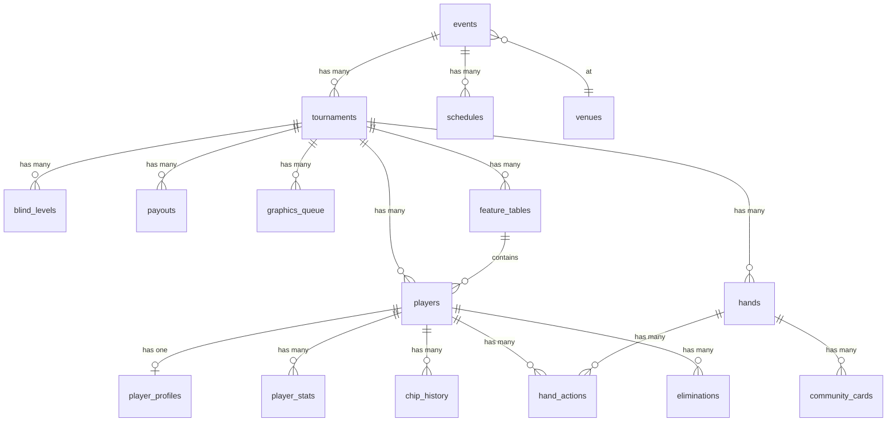

# PRD: Caption Database Schema

**PRD Number**: PRD-0004
**Version**: 1.2
**Date**: 2026-01-06
**Status**: Draft
**Parent PRD**: PRD-0003 (Caption Workflow), PRD-0001 (Broadcast Graphics)

### Changelog
| Version | Date | Changes |
|---------|------|---------|
| 1.2 | 2026-01-06 | SQL migration 파일 분리 (001/002/003), View 11개 + 함수 6개 추가, 자동 트리거 추가 |
| 1.1 | 2026-01-06 | pokerGFX JSON 스키마 반영 - gfx_sessions 테이블 추가, hands/hand_actions 확장, 카드 형식 변환 규칙 추가 |
| 1.0 | 2026-01-06 | Initial PRD - 26개 자막 유형 통합 DB 스키마, 3가지 데이터 소스 통합, 15개 테이블 정의 |

### Source Documents
| Document | Location |
|----------|----------|
| PRD-0001 | [WSOP Broadcast Graphics](./0001-prd-wsop-broadcast-graphics.md) |
| PRD-0003 | [Caption Workflow](./0003-prd-caption-workflow.md) |
| PRD-0002 (Feature Table) | [GFX RFID 기술 상세](../../../automation_feature_table/tasks/prds/PRD-0002-primary-gfx-rfid.md) |

---

## 1. Purpose & Context

### 1.1 Background

PRD-0003에서 정의된 10개 테이블을 확장하여, PRD-0001의 **26개 자막 유형 전체**를 지원하는 완전한 DB 스키마를 정의합니다.

**기존 PRD-0003 범위**:
- 10개 핵심 테이블 정의
- 데이터 수집 워크플로우 정의
- 이벤트 트리거 시스템

**PRD-0004 확장 범위**:
- 15개 테이블로 확장 (5개 신규)
- 26개 자막 유형별 데이터 매핑 완성
- 3가지 데이터 소스 통합 스키마
- TypeScript 타입 정의 포함

### 1.2 Goals

1. **완전한 스키마 정의**: 26개 자막 유형 전체 커버
2. **데이터 소스 통합**: pokerGFX JSON, WSOP+ CSV, 수기 입력 통합
3. **ERD 시각화**: Mermaid 다이어그램 포함
4. **타입 안전성**: TypeScript/Python 타입 정의

### 1.3 Non-Goals

- 데이터 수집 워크플로우 (PRD-0003 담당)
- 자막 디자인/컴포넌트 (PRD-0001 담당)
- 마이그레이션 스크립트 실행 (별도 작업)

---

## 2. Data Source Integration

### 2.1 3가지 데이터 소스 (상호 배타적)

| 소스 | 범위 | 데이터 유형 | 지연 시간 |
|------|------|------------|----------|
| **pokerGFX JSON** | Feature Table 전용 | RFID 핸드/카드/칩 데이터 | < 2초 |
| **WSOP+ CSV** | 대회 정보 + Other Tables | 순위, 상금, 블라인드 | 수동 |
| **수기 입력** | 자동화 불가 정보 | 프로필, 좌석, 코멘테이터 | 수동 |

### 2.2 pokerGFX JSON 스키마 상세

> **Source**: PokerGFX 3.2+ (Enterprise/Pro License)

#### 2.2.1 최상위 구조 (Session)

```json
{
  "CreatedDateTimeUTC": "2025-10-16T08:25:17.0907267Z",
  "EventTitle": "WSOP Main Event Day 3",
  "Hands": [...],
  "ID": 638961999170907267,
  "Payouts": [0,0,0,0,0,0,0,0,0,0],
  "SoftwareVersion": "PokerGFX 3.2",
  "Type": "FEATURE_TABLE"
}
```

| 필드 | 타입 | DB 컬럼 | 설명 |
|------|------|---------|------|
| `ID` | number | `gfx_sessions.gfx_id` | 세션 고유 ID |
| `CreatedDateTimeUTC` | string | `gfx_sessions.created_at_gfx` | 세션 생성 시간 (ISO 8601) |
| `EventTitle` | string | `gfx_sessions.event_title` | 이벤트 제목 |
| `Type` | string | `gfx_sessions.table_type` | 테이블 타입 (FEATURE_TABLE) |
| `SoftwareVersion` | string | `gfx_sessions.software_version` | PokerGFX 버전 |
| `Hands` | array | → `hands` 테이블 | 핸드 객체 배열 |
| `Payouts` | array | `gfx_sessions.payouts` | 페이아웃 배열 (JSONB) |

#### 2.2.2 Hand 객체

```json
{
  "HandNum": 2,
  "GameVariant": "HOLDEM",
  "GameClass": "FLOP",
  "BetStructure": "NOLIMIT",
  "Duration": "PT2M56.2628165S",
  "StartDateTimeUTC": "2025-10-16T08:28:43.2539856Z",
  "NumBoards": 1,
  "RunItNumTimes": 1,
  "Players": [...],
  "Events": [...],
  "FlopDrawBlinds": {...}
}
```

| 필드 | 타입 | DB 컬럼 | 설명 |
|------|------|---------|------|
| `HandNum` | number | `hands.hand_number` | 핸드 번호 |
| `GameVariant` | string | `hands.game_variant` | 게임 종류 (HOLDEM, OMAHA) |
| `GameClass` | string | `hands.game_class` | 게임 클래스 (FLOP, DRAW) |
| `BetStructure` | string | `hands.bet_structure` | 베팅 구조 (NOLIMIT, POTLIMIT, LIMIT) |
| `Duration` | string | `hands.duration` | 핸드 진행 시간 (ISO 8601 Duration) |
| `StartDateTimeUTC` | string | `hands.started_at` | 핸드 시작 시간 |
| `NumBoards` | number | `hands.num_boards` | 보드 수 (Run It Twice 등) |
| `RunItNumTimes` | number | `hands.run_it_num_times` | Run It 횟수 |

#### 2.2.3 Player 객체 (핸드 내)

```json
{
  "PlayerNum": 7,
  "Name": "Phil Ivey",
  "LongName": "Phillip Dennis Ivey Jr.",
  "StartStackAmt": 9000000,
  "EndStackAmt": 12500000,
  "CumulativeWinningsAmt": 3500000,
  "HoleCards": ["as", "kh"],
  "SittingOut": false,
  "EliminationRank": -1,
  "VPIPPercent": 28.5,
  "PreFlopRaisePercent": 22.3,
  "AggressionFrequencyPercent": 45.2,
  "WentToShowDownPercent": 31.0
}
```

| 필드 | 타입 | DB 컬럼 | 설명 |
|------|------|---------|------|
| `PlayerNum` | number | `hand_players.seat_number` | 시트 번호 (1-10) |
| `Name` | string | `players.name` | 플레이어 이름 |
| `LongName` | string | `player_profiles.long_name` | 플레이어 전체 이름 |
| `StartStackAmt` | number | `hand_players.start_stack` | 핸드 시작 스택 |
| `EndStackAmt` | number | `hand_players.end_stack` | 핸드 종료 스택 |
| `CumulativeWinningsAmt` | number | `hand_players.cumulative_winnings` | 누적 수익 |
| `HoleCards` | array | `hand_players.hole_cards` | 홀 카드 (2장) |
| `SittingOut` | boolean | `hand_players.sitting_out` | 자리 비움 여부 |
| `EliminationRank` | number | `eliminations.final_rank` | 탈락 순위 (-1: 미탈락) |
| `VPIPPercent` | number | `player_stats.vpip` | VPIP 통계 |
| `PreFlopRaisePercent` | number | `player_stats.pfr` | PFR 통계 |
| `AggressionFrequencyPercent` | number | `player_stats.aggression_factor` | AF 통계 |
| `WentToShowDownPercent` | number | `player_stats.showdown_win_rate` | WTSD 통계 |

#### 2.2.4 Event 객체 (액션)

```json
{
  "EventType": "RAISE",
  "PlayerNum": 5,
  "BetAmt": 180000,
  "Pot": 370000,
  "BoardCards": null,
  "BoardNum": 0,
  "DateTimeUTC": "2025-10-16T08:29:15.123Z",
  "NumCardsDrawn": 0
}
```

| 필드 | 타입 | DB 컬럼 | 설명 |
|------|------|---------|------|
| `EventType` | string | `hand_actions.action` | 이벤트 타입 (아래 참조) |
| `PlayerNum` | number | `hand_actions.seat_number` | 플레이어 시트 번호 |
| `BetAmt` | number | `hand_actions.bet_amount` | 베팅 금액 |
| `Pot` | number | `hand_actions.pot_size_after` | 현재 팟 |
| `BoardCards` | array | → `community_cards` | 보드 카드 (BOARD_CARD 이벤트 시) |
| `BoardNum` | number | `community_cards.board_num` | 보드 번호 (Run It Twice) |
| `DateTimeUTC` | string | `hand_actions.timestamp` | 이벤트 시간 |
| `NumCardsDrawn` | number | `hand_actions.num_cards_drawn` | 드로우한 카드 수 |

**EventType 매핑**:

| GFX EventType | DB action | 설명 |
|---------------|-----------|------|
| `FOLD` | `fold` | 폴드 |
| `CALL` | `call` | 콜 |
| `CHECK` | `check` | 체크 |
| `RAISE` | `raise` | 레이즈 |
| `BET` | `bet` | 베팅 |
| `ALL_IN` | `all-in` | 올인 |
| `BOARD CARD` | - | 보드 카드 공개 (→ community_cards) |
| `SHOWDOWN` | `showdown` | 쇼다운 |

#### 2.2.5 FlopDrawBlinds 객체

```json
{
  "ButtonPlayerNum": 2,
  "SmallBlindPlayerNum": 3,
  "SmallBlindAmt": 50000,
  "BigBlindPlayerNum": 4,
  "BigBlindAmt": 100000,
  "AnteType": "BB_ANTE_BB1ST",
  "BlindLevel": 15
}
```

| 필드 | 타입 | DB 컬럼 | 설명 |
|------|------|---------|------|
| `ButtonPlayerNum` | number | `hands.button_seat` | 버튼 위치 |
| `SmallBlindPlayerNum` | number | `hands.small_blind_seat` | SB 위치 |
| `SmallBlindAmt` | number | `hands.small_blind_amount` | SB 금액 |
| `BigBlindPlayerNum` | number | `hands.big_blind_seat` | BB 위치 |
| `BigBlindAmt` | number | `hands.big_blind_amount` | BB 금액 |
| `AnteType` | string | `hands.ante_type` | 앤티 타입 |
| `BlindLevel` | number | `hands.level_number` | 블라인드 레벨 |

### 2.3 카드 형식 변환

pokerGFX와 내부 DB/phevaluator 간 카드 형식 변환:

| 구분 | pokerGFX | DB 저장 | phevaluator |
|------|----------|---------|-------------|
| **Rank** | 소문자 (a, k, q, j, 10) | 대문자 (A, K, Q, J, T) | 대문자 |
| **Suit** | 소문자 (h, d, c, s) | 소문자 | 소문자 |
| **예시** | `as`, `kh`, `10d`, `jc` | `As`, `Kh`, `Td`, `Jc` | `As`, `Kh`, `Td`, `Jc` |

**변환 규칙**:
1. Rank 첫 글자 대문자로 변환
2. `10` → `T` 변환
3. Suit는 소문자 유지

```python
def convert_gfx_card(gfx_card: str) -> str:
    """pokerGFX 카드 형식을 DB/phevaluator 형식으로 변환"""
    rank = gfx_card[:-1].upper()
    suit = gfx_card[-1].lower()
    if rank == '10':
        rank = 'T'
    return f"{rank}{suit}"
```

### 2.4 테이블별 소스 매핑

```
┌─────────────────────────────────────────────────────────────────┐
│                    데이터 소스 → 테이블 매핑                      │
├─────────────────────────────────────────────────────────────────┤
│                                                                   │
│  pokerGFX JSON (RFID)          WSOP+ CSV            수기 입력     │
│  ─────────────────────        ─────────────        ────────────  │
│  ┌─────────────────┐          ┌───────────┐       ┌───────────┐  │
│  │ hand_actions    │          │tournaments│       │player_    │  │
│  │ (Feature Table) │          │           │       │profiles   │  │
│  └────────┬────────┘          └─────┬─────┘       └─────┬─────┘  │
│           │                         │                   │        │
│  ┌────────▼────────┐          ┌─────▼─────┐       ┌─────▼─────┐  │
│  │ chip_history    │          │ payouts   │       │commentators│ │
│  │ (Feature Only)  │          │           │       │           │  │
│  └────────┬────────┘          └─────┬─────┘       └─────┬─────┘  │
│           │                         │                   │        │
│  ┌────────▼────────┐          ┌─────▼─────┐       ┌─────▼─────┐  │
│  │ community_cards │          │blind_     │       │ events    │  │
│  │                 │          │levels     │       │ venues    │  │
│  └─────────────────┘          └───────────┘       └───────────┘  │
│                                                                   │
└─────────────────────────────────────────────────────────────────┘
```

---

## 3. Complete Database Schema

### 3.1 ERD Diagram (Mermaid)



### 3.2 테이블 목록 (20개)

| # | 테이블 | 설명 | PRD-0003 | 신규 | GFX |
|---|--------|------|:--------:|:----:|:---:|
| 1 | `events` | 이벤트 (WSOP LV, Cyprus 등) | O | - | - |
| 2 | `venues` | 장소 정보 | O | - | - |
| 3 | `tournaments` | 토너먼트 정보 | O | - | - |
| 4 | `players` | 플레이어 정보 | O | - | - |
| 5 | `player_profiles` | 플레이어 프로필 상세 | O | - | - |
| 6 | `player_stats` | 플레이어 통계 (VPIP, PFR) | O | - | O |
| 7 | `chip_history` | 칩 변동 히스토리 | O | - | O |
| 8 | `hand_actions` | 핸드 액션 로그 | O | - | O |
| 9 | `payouts` | 상금 구조 | O | - | - |
| 10 | `blind_levels` | 블라인드 레벨 | O | - | - |
| 11 | `graphics_queue` | 그래픽 큐 | O | - | - |
| 12 | `commentators` | 코멘테이터 정보 | O | - | - |
| 13 | `schedules` | 방송 스케줄 | O | - | - |
| 14 | `hands` | 핸드 메타정보 (GFX 확장) | - | **O** | O |
| 15 | `community_cards` | 커뮤니티 카드 | - | **O** | O |
| 16 | `feature_tables` | 피처 테이블 관리 | - | **O** | - |
| 17 | `eliminations` | 탈락 상세 정보 | - | **O** | O |
| 18 | `soft_contents` | 소프트 콘텐츠 큐 | - | **O** | - |
| 19 | `gfx_sessions` | **pokerGFX 세션 데이터** | - | **O** | O |
| 20 | `hand_players` | **핸드별 플레이어 상태** | - | **O** | O |

> **GFX**: pokerGFX JSON에서 데이터를 수신하는 테이블

---

## 4. Table Definitions

### 4.1 Core Tables (PRD-0003 확장)

#### 4.1.1 events

```sql
CREATE TABLE events (
    id UUID PRIMARY KEY DEFAULT gen_random_uuid(),
    name VARCHAR(255) NOT NULL,
    event_code VARCHAR(50) UNIQUE NOT NULL,  -- 'WSOP_2026_LV', 'WSOP_2025_SC_CYPRUS'
    venue_id UUID REFERENCES venues(id),
    start_date DATE NOT NULL,
    end_date DATE NOT NULL,
    status VARCHAR(20) DEFAULT 'scheduled',  -- 'scheduled', 'running', 'completed'
    logo_url TEXT,
    sponsor_logos JSONB DEFAULT '[]',  -- [{"name": "LuxonPay", "url": "..."}]
    created_at TIMESTAMP DEFAULT CURRENT_TIMESTAMP,
    updated_at TIMESTAMP DEFAULT CURRENT_TIMESTAMP
);

CREATE INDEX idx_events_code ON events(event_code);
CREATE INDEX idx_events_status ON events(status);
```

**자막 매핑**: Event Name, Venue/Location, Broadcast Schedule

#### 4.1.2 venues

```sql
CREATE TABLE venues (
    id UUID PRIMARY KEY DEFAULT gen_random_uuid(),
    name VARCHAR(255) NOT NULL,
    city VARCHAR(100),
    country CHAR(2),  -- ISO 3166-1 alpha-2
    address TEXT,
    drone_shot_url TEXT,  -- 드론샷 이미지/영상 URL
    photo_urls JSONB DEFAULT '[]',  -- 다양한 각도 사진
    created_at TIMESTAMP DEFAULT CURRENT_TIMESTAMP
);
```

**자막 매핑**: Venue/Location

#### 4.1.3 tournaments

```sql
CREATE TABLE tournaments (
    id UUID PRIMARY KEY DEFAULT gen_random_uuid(),
    event_id UUID NOT NULL REFERENCES events(id) ON DELETE CASCADE,
    name VARCHAR(255) NOT NULL,
    buy_in DECIMAL(10,2) NOT NULL,
    starting_chips INTEGER NOT NULL,
    current_level INTEGER DEFAULT 1,
    current_day INTEGER DEFAULT 1,  -- Day 1, 2, 3, Final

    -- 참가자 정보
    registered_players INTEGER DEFAULT 0,
    remaining_players INTEGER DEFAULT 0,

    -- 상금 정보
    prize_pool DECIMAL(15,2) DEFAULT 0,
    bubble_line INTEGER,  -- ITM 진입 라인
    is_itm BOOLEAN DEFAULT FALSE,

    -- 등록 상태
    is_registration_open BOOLEAN DEFAULT TRUE,
    registration_closes_at TIMESTAMP,

    -- 평균 스택 (계산값)
    avg_stack INTEGER,

    status VARCHAR(20) DEFAULT 'scheduled',
    created_at TIMESTAMP DEFAULT CURRENT_TIMESTAMP,
    updated_at TIMESTAMP DEFAULT CURRENT_TIMESTAMP
);

CREATE INDEX idx_tournaments_event ON tournaments(event_id);
CREATE INDEX idx_tournaments_status ON tournaments(status);
CREATE INDEX idx_tournaments_day ON tournaments(current_day);
```

**자막 매핑**: Tournament Info, Event Info, Tournament Leaderboard, L-Bar

#### 4.1.4 players

```sql
CREATE TABLE players (
    id UUID PRIMARY KEY DEFAULT gen_random_uuid(),
    tournament_id UUID NOT NULL REFERENCES tournaments(id) ON DELETE CASCADE,

    -- 기본 정보
    name VARCHAR(255) NOT NULL,
    nationality CHAR(2) NOT NULL,  -- ISO 3166-1 alpha-2
    photo_url TEXT,

    -- 칩/좌석 정보
    chips INTEGER NOT NULL DEFAULT 0,
    seat_number INTEGER,  -- 1-10
    table_number INTEGER,

    -- 피처 테이블 여부
    is_feature_table BOOLEAN DEFAULT FALSE,
    feature_table_id UUID REFERENCES feature_tables(id),

    -- 탈락 정보
    is_eliminated BOOLEAN DEFAULT FALSE,
    eliminated_at TIMESTAMP,
    final_rank INTEGER,
    payout_received DECIMAL(12,2),

    -- 순위 정보 (실시간 계산)
    current_rank INTEGER,
    rank_change INTEGER DEFAULT 0,  -- +/- from previous
    bb_count DECIMAL(10,2),  -- chips / big_blind
    avg_stack_percentage DECIMAL(6,2),  -- chips / avg_stack * 100

    registration_time TIMESTAMP DEFAULT CURRENT_TIMESTAMP,
    created_at TIMESTAMP DEFAULT CURRENT_TIMESTAMP,
    updated_at TIMESTAMP DEFAULT CURRENT_TIMESTAMP
);

CREATE INDEX idx_players_tournament ON players(tournament_id);
CREATE INDEX idx_players_chips ON players(chips DESC);
CREATE INDEX idx_players_table ON players(table_number, seat_number);
CREATE INDEX idx_players_feature ON players(is_feature_table) WHERE is_feature_table = TRUE;
CREATE INDEX idx_players_eliminated ON players(is_eliminated);
CREATE INDEX idx_players_rank ON players(current_rank);
```

**자막 매핑**:
- Tournament Leaderboard (chips, current_rank, rank_change, bb_count)
- Feature Table Leaderboard (chips, seat_number, nationality)
- Mini Chip Counts (chips, rank_change)
- At Risk of Elimination (chips, bb_count, current_rank)
- Elimination Banner (final_rank, payout_received)

#### 4.1.5 player_profiles

```sql
CREATE TABLE player_profiles (
    id UUID PRIMARY KEY DEFAULT gen_random_uuid(),
    player_id UUID UNIQUE NOT NULL REFERENCES players(id) ON DELETE CASCADE,

    -- 외부 ID
    hendon_mob_id VARCHAR(50),
    gpi_id VARCHAR(50),

    -- WSOP 성적
    wsop_bracelets INTEGER DEFAULT 0,
    wsop_rings INTEGER DEFAULT 0,
    wsop_final_tables INTEGER DEFAULT 0,

    -- 전체 성적
    total_earnings DECIMAL(15,2) DEFAULT 0,
    final_tables INTEGER DEFAULT 0,

    -- 프로필 정보
    biography TEXT,
    notable_wins JSONB DEFAULT '[]',  -- [{"event": "...", "year": 2023, "prize": 1000000}]
    hometown VARCHAR(255),
    age INTEGER,
    profession VARCHAR(255),

    -- 소셜 링크
    social_links JSONB DEFAULT '{}',  -- {"twitter": "...", "instagram": "..."}

    -- 키플레이어 태그
    is_key_player BOOLEAN DEFAULT FALSE,
    key_player_reason TEXT,  -- "2-time bracelet winner", "Online qualifier"

    created_at TIMESTAMP DEFAULT CURRENT_TIMESTAMP,
    updated_at TIMESTAMP DEFAULT CURRENT_TIMESTAMP
);

CREATE INDEX idx_profiles_hendon ON player_profiles(hendon_mob_id);
CREATE INDEX idx_profiles_bracelets ON player_profiles(wsop_bracelets DESC);
CREATE INDEX idx_profiles_earnings ON player_profiles(total_earnings DESC);
CREATE INDEX idx_profiles_key_player ON player_profiles(is_key_player) WHERE is_key_player = TRUE;
```

**자막 매핑**:
- Player Profile (wsop_bracelets, total_earnings, hometown)
- Player Intro Card (biography, notable_wins, profession)
- Heads-Up Comparison (wsop_bracelets, total_earnings)

#### 4.1.6 player_stats

```sql
CREATE TABLE player_stats (
    id UUID PRIMARY KEY DEFAULT gen_random_uuid(),
    player_id UUID NOT NULL REFERENCES players(id) ON DELETE CASCADE,
    tournament_id UUID NOT NULL REFERENCES tournaments(id) ON DELETE CASCADE,

    -- 핸드 통계
    hands_played INTEGER DEFAULT 0,
    hands_won INTEGER DEFAULT 0,

    -- VPIP/PFR (PRD-0001 4.2.4)
    vpip DECIMAL(5,2) DEFAULT 0,  -- Voluntarily Put $ In Pot (0-100%)
    pfr DECIMAL(5,2) DEFAULT 0,   -- Pre-Flop Raise (0-100%)

    -- 고급 통계
    aggression_factor DECIMAL(5,2),  -- (Bet + Raise) / Call
    showdown_win_rate DECIMAL(5,2),
    three_bet_percentage DECIMAL(5,2),
    fold_to_three_bet DECIMAL(5,2),
    c_bet_percentage DECIMAL(5,2),  -- Continuation Bet

    -- All-in 통계
    all_in_count INTEGER DEFAULT 0,
    all_in_won INTEGER DEFAULT 0,

    last_calculated_at TIMESTAMP DEFAULT CURRENT_TIMESTAMP,
    UNIQUE(player_id, tournament_id)
);

CREATE INDEX idx_stats_player ON player_stats(player_id);
CREATE INDEX idx_stats_vpip ON player_stats(vpip);
CREATE INDEX idx_stats_pfr ON player_stats(pfr);
```

**자막 매핑**:
- VPIP Stats (vpip, pfr)
- Heads-Up Comparison (aggression_factor, showdown_win_rate)

#### 4.1.7 chip_history

```sql
CREATE TABLE chip_history (
    id UUID PRIMARY KEY DEFAULT gen_random_uuid(),
    player_id UUID NOT NULL REFERENCES players(id) ON DELETE CASCADE,
    tournament_id UUID NOT NULL REFERENCES tournaments(id) ON DELETE CASCADE,

    -- 핸드/레벨 정보
    hand_id UUID REFERENCES hands(id),
    hand_number INTEGER NOT NULL,
    level_number INTEGER NOT NULL,

    -- 칩 정보
    chips INTEGER NOT NULL,
    chips_change INTEGER DEFAULT 0,  -- +/- from previous hand

    -- 계산값
    bb_count DECIMAL(10,2),  -- chips / big_blind
    avg_stack_percentage DECIMAL(6,2),  -- chips / avg_stack * 100

    -- 데이터 소스
    source VARCHAR(20) DEFAULT 'rfid',  -- 'rfid', 'manual', 'csv'

    timestamp TIMESTAMP DEFAULT CURRENT_TIMESTAMP
);

CREATE INDEX idx_chip_history_player ON chip_history(player_id);
CREATE INDEX idx_chip_history_tournament ON chip_history(tournament_id);
CREATE INDEX idx_chip_history_hand ON chip_history(hand_number DESC);
CREATE INDEX idx_chip_history_timestamp ON chip_history(timestamp DESC);
CREATE INDEX idx_chip_history_player_recent ON chip_history(player_id, hand_number DESC);
```

**자막 매핑**:
- Chip Flow (최근 15개 레코드)
- Chip Comparison (2인 이상 비교)
- Chip Stack Bar (순위별 스택)

#### 4.1.8 payouts

```sql
CREATE TABLE payouts (
    id UUID PRIMARY KEY DEFAULT gen_random_uuid(),
    tournament_id UUID NOT NULL REFERENCES tournaments(id) ON DELETE CASCADE,

    -- 순위 범위
    place_start INTEGER NOT NULL,  -- 1, 2, 3, 4 (for 4-5), 6 (for 6-9), ...
    place_end INTEGER NOT NULL,    -- 1, 2, 3, 5, 9, ...

    -- 상금 정보
    amount DECIMAL(12,2) NOT NULL,
    percentage DECIMAL(5,2),  -- of total prize pool

    -- 버블 표시
    is_current_bubble BOOLEAN DEFAULT FALSE,

    -- 달성 여부
    is_reached BOOLEAN DEFAULT FALSE,

    created_at TIMESTAMP DEFAULT CURRENT_TIMESTAMP,
    UNIQUE(tournament_id, place_start, place_end)
);

CREATE INDEX idx_payouts_tournament ON payouts(tournament_id);
CREATE INDEX idx_payouts_place ON payouts(place_start, place_end);
CREATE INDEX idx_payouts_bubble ON payouts(is_current_bubble) WHERE is_current_bubble = TRUE;
```

**자막 매핑**:
- Payouts (Main) (전체 상금 구조)
- Mini Payouts (현재/다음 페이점프)
- At Risk of Elimination (payout_at_risk)

#### 4.1.9 blind_levels

```sql
CREATE TABLE blind_levels (
    id UUID PRIMARY KEY DEFAULT gen_random_uuid(),
    tournament_id UUID NOT NULL REFERENCES tournaments(id) ON DELETE CASCADE,

    -- 레벨 정보
    level_number INTEGER NOT NULL,
    small_blind INTEGER NOT NULL,
    big_blind INTEGER NOT NULL,
    ante INTEGER DEFAULT 0,
    big_blind_ante INTEGER DEFAULT 0,  -- BBA (Big Blind Ante)

    -- 시간 정보
    duration_minutes INTEGER NOT NULL,

    -- 브레이크
    is_break BOOLEAN DEFAULT FALSE,
    break_duration_minutes INTEGER,

    -- 상태
    is_current BOOLEAN DEFAULT FALSE,
    started_at TIMESTAMP,
    ends_at TIMESTAMP,

    created_at TIMESTAMP DEFAULT CURRENT_TIMESTAMP,
    UNIQUE(tournament_id, level_number)
);

CREATE INDEX idx_blinds_tournament ON blind_levels(tournament_id);
CREATE INDEX idx_blinds_level ON blind_levels(level_number);
CREATE INDEX idx_blinds_current ON blind_levels(is_current) WHERE is_current = TRUE;
```

**자막 매핑**:
- Blind Level (current_level, blinds, ante, duration)
- L-Bar (Standard) (blinds 정보)
- Chips In Play (칩 단위 계산 기준)

#### 4.1.10 commentators

```sql
CREATE TABLE commentators (
    id UUID PRIMARY KEY DEFAULT gen_random_uuid(),

    -- 기본 정보
    name VARCHAR(255) NOT NULL,
    photo_url TEXT,

    -- 프로필
    credentials TEXT,  -- "WSOP Bracelet Winner", "Professional Poker Player"
    biography TEXT,

    -- 소셜 링크
    social_links JSONB DEFAULT '{}',

    -- 활성 상태
    is_active BOOLEAN DEFAULT TRUE,

    created_at TIMESTAMP DEFAULT CURRENT_TIMESTAMP
);
```

**자막 매핑**: Commentator Profile

#### 4.1.11 schedules

```sql
CREATE TABLE schedules (
    id UUID PRIMARY KEY DEFAULT gen_random_uuid(),
    event_id UUID REFERENCES events(id) ON DELETE CASCADE,

    -- 스케줄 정보
    date DATE NOT NULL,
    time_start TIME NOT NULL,
    time_end TIME,
    event_name VARCHAR(255) NOT NULL,
    channel VARCHAR(100),

    -- 방송 상태
    is_live BOOLEAN DEFAULT FALSE,
    is_current BOOLEAN DEFAULT FALSE,  -- 현재 방송 중

    created_at TIMESTAMP DEFAULT CURRENT_TIMESTAMP
);

CREATE INDEX idx_schedules_event ON schedules(event_id);
CREATE INDEX idx_schedules_date ON schedules(date);
CREATE INDEX idx_schedules_current ON schedules(is_current) WHERE is_current = TRUE;
```

**자막 매핑**: Broadcast Schedule

#### 4.1.12 graphics_queue

```sql
CREATE TABLE graphics_queue (
    id UUID PRIMARY KEY DEFAULT gen_random_uuid(),
    tournament_id UUID REFERENCES tournaments(id) ON DELETE SET NULL,

    -- 그래픽 정보
    graphic_type VARCHAR(50) NOT NULL,  -- 26개 자막 유형 코드
    trigger_event VARCHAR(50) NOT NULL,  -- 트리거 이벤트

    -- 데이터 페이로드
    payload JSONB NOT NULL DEFAULT '{}',

    -- 우선순위 (1 = 최고, 10 = 최저)
    priority INTEGER DEFAULT 5,

    -- 상태
    status VARCHAR(20) DEFAULT 'pending',  -- 'pending', 'rendering', 'displayed', 'dismissed', 'failed'
    error_message TEXT,

    -- 타임스탬프
    created_at TIMESTAMP DEFAULT CURRENT_TIMESTAMP,
    rendered_at TIMESTAMP,
    displayed_at TIMESTAMP,
    dismissed_at TIMESTAMP
);

CREATE INDEX idx_queue_tournament ON graphics_queue(tournament_id);
CREATE INDEX idx_queue_status ON graphics_queue(status);
CREATE INDEX idx_queue_priority ON graphics_queue(priority);
CREATE INDEX idx_queue_pending ON graphics_queue(status, priority, created_at) WHERE status = 'pending';
```

---

### 4.2 New Tables (PRD-0004)

#### 4.2.1 gfx_sessions (신규) - pokerGFX 세션

```sql
CREATE TABLE gfx_sessions (
    id UUID PRIMARY KEY DEFAULT gen_random_uuid(),
    tournament_id UUID REFERENCES tournaments(id) ON DELETE SET NULL,
    feature_table_id UUID REFERENCES feature_tables(id) ON DELETE SET NULL,

    -- GFX 원본 데이터
    gfx_id BIGINT UNIQUE NOT NULL,  -- pokerGFX ID (638961999170907267)
    event_title VARCHAR(255),
    table_type VARCHAR(50) DEFAULT 'FEATURE_TABLE',  -- 'FEATURE_TABLE', 'OUTER_TABLE'
    software_version VARCHAR(50),  -- 'PokerGFX 3.2'

    -- 페이아웃 (JSONB)
    payouts JSONB DEFAULT '[]',  -- [0,0,0,0,0,0,0,0,0,0]

    -- 타임스탬프
    created_at_gfx TIMESTAMP NOT NULL,  -- GFX CreatedDateTimeUTC
    imported_at TIMESTAMP DEFAULT CURRENT_TIMESTAMP,

    -- 상태
    status VARCHAR(20) DEFAULT 'active',  -- 'active', 'closed', 'archived'
    total_hands INTEGER DEFAULT 0
);

CREATE INDEX idx_gfx_sessions_gfx_id ON gfx_sessions(gfx_id);
CREATE INDEX idx_gfx_sessions_tournament ON gfx_sessions(tournament_id);
CREATE INDEX idx_gfx_sessions_feature_table ON gfx_sessions(feature_table_id);
CREATE INDEX idx_gfx_sessions_status ON gfx_sessions(status);
```

**자막 매핑**: 세션 메타데이터, Feature Table 식별

#### 4.2.2 hands (신규) - GFX Hand 확장

```sql
CREATE TABLE hands (
    id UUID PRIMARY KEY DEFAULT gen_random_uuid(),
    gfx_session_id UUID REFERENCES gfx_sessions(id) ON DELETE CASCADE,
    tournament_id UUID NOT NULL REFERENCES tournaments(id) ON DELETE CASCADE,

    -- 핸드 정보 (GFX)
    hand_number INTEGER NOT NULL,
    table_number INTEGER NOT NULL,

    -- 게임 정보 (GFX GameVariant, GameClass, BetStructure)
    game_variant VARCHAR(20) DEFAULT 'HOLDEM',  -- 'HOLDEM', 'OMAHA', 'STUD'
    game_class VARCHAR(20) DEFAULT 'FLOP',  -- 'FLOP', 'DRAW', 'STUD'
    bet_structure VARCHAR(20) DEFAULT 'NOLIMIT',  -- 'NOLIMIT', 'POTLIMIT', 'LIMIT'

    -- 블라인드 정보 (GFX FlopDrawBlinds)
    level_number INTEGER NOT NULL,
    button_seat INTEGER,  -- ButtonPlayerNum
    small_blind_seat INTEGER,  -- SmallBlindPlayerNum
    small_blind_amount DECIMAL(12,2),  -- SmallBlindAmt
    big_blind_seat INTEGER,  -- BigBlindPlayerNum
    big_blind_amount DECIMAL(12,2),  -- BigBlindAmt
    ante_type VARCHAR(30),  -- 'BB_ANTE_BB1ST', 'ANTE_ALL', etc.

    -- Run It 정보 (GFX)
    num_boards INTEGER DEFAULT 1,  -- NumBoards
    run_it_num_times INTEGER DEFAULT 1,  -- RunItNumTimes

    -- 팟 정보
    pot_size DECIMAL(12,2) DEFAULT 0,
    rake DECIMAL(10,2) DEFAULT 0,

    -- 결과
    winner_id UUID REFERENCES players(id),
    winning_hand VARCHAR(50),  -- "Full House, Aces full of Kings"

    -- 시간 정보 (GFX)
    duration INTERVAL,  -- GFX Duration (PT2M56.2628165S → interval)
    started_at TIMESTAMP NOT NULL,  -- GFX StartDateTimeUTC
    completed_at TIMESTAMP,

    -- 상태
    status VARCHAR(20) DEFAULT 'in_progress',  -- 'in_progress', 'completed', 'void'

    UNIQUE(tournament_id, hand_number, table_number)
);

CREATE INDEX idx_hands_gfx_session ON hands(gfx_session_id);
CREATE INDEX idx_hands_tournament ON hands(tournament_id);
CREATE INDEX idx_hands_table ON hands(table_number);
CREATE INDEX idx_hands_number ON hands(hand_number DESC);
CREATE INDEX idx_hands_winner ON hands(winner_id);
CREATE INDEX idx_hands_game_variant ON hands(game_variant);
```

**자막 매핑**: Chip Flow (hand_number 기준), Hand Highlight (Soft Contents)

#### 4.2.3 hand_players (신규) - 핸드별 플레이어 상태

```sql
CREATE TABLE hand_players (
    id UUID PRIMARY KEY DEFAULT gen_random_uuid(),
    hand_id UUID NOT NULL REFERENCES hands(id) ON DELETE CASCADE,
    player_id UUID NOT NULL REFERENCES players(id) ON DELETE CASCADE,

    -- 시트 정보 (GFX PlayerNum)
    seat_number INTEGER NOT NULL,  -- 1-10

    -- 스택 정보 (GFX StartStackAmt, EndStackAmt)
    start_stack DECIMAL(12,2) NOT NULL,
    end_stack DECIMAL(12,2) NOT NULL,
    cumulative_winnings DECIMAL(12,2) DEFAULT 0,  -- CumulativeWinningsAmt

    -- 카드 정보 (GFX HoleCards)
    hole_cards VARCHAR(10),  -- 'AsKh' (변환된 형식)

    -- 상태 (GFX)
    sitting_out BOOLEAN DEFAULT FALSE,  -- SittingOut
    is_winner BOOLEAN DEFAULT FALSE,

    -- 실시간 통계 (GFX 제공)
    vpip_percent DECIMAL(5,2),  -- VPIPPercent
    pfr_percent DECIMAL(5,2),  -- PreFlopRaisePercent
    aggression_percent DECIMAL(5,2),  -- AggressionFrequencyPercent
    wtsd_percent DECIMAL(5,2),  -- WentToShowDownPercent

    created_at TIMESTAMP DEFAULT CURRENT_TIMESTAMP,

    UNIQUE(hand_id, seat_number)
);

CREATE INDEX idx_hand_players_hand ON hand_players(hand_id);
CREATE INDEX idx_hand_players_player ON hand_players(player_id);
CREATE INDEX idx_hand_players_seat ON hand_players(seat_number);
CREATE INDEX idx_hand_players_winner ON hand_players(is_winner) WHERE is_winner = TRUE;
```

**자막 매핑**: Player Stats, Chip Flow, Heads-Up Comparison

#### 4.2.4 hand_actions (확장) - GFX Event 매핑

```sql
CREATE TABLE hand_actions (
    id UUID PRIMARY KEY DEFAULT gen_random_uuid(),
    hand_id UUID NOT NULL REFERENCES hands(id) ON DELETE CASCADE,
    tournament_id UUID NOT NULL REFERENCES tournaments(id) ON DELETE CASCADE,
    player_id UUID REFERENCES players(id) ON DELETE CASCADE,  -- NULL for BOARD_CARD events

    -- 포지션 정보 (GFX PlayerNum)
    seat_number INTEGER,  -- 1-10 (GFX PlayerNum)
    position_name VARCHAR(20),  -- 'BTN', 'SB', 'BB', 'UTG', 'MP', 'CO', etc.

    -- 액션 정보 (GFX Event)
    street VARCHAR(10) NOT NULL,  -- 'preflop', 'flop', 'turn', 'river'
    action_order INTEGER NOT NULL,  -- 해당 스트리트 내 순서
    action VARCHAR(20) NOT NULL,  -- 'fold', 'call', 'raise', 'check', 'bet', 'all-in', 'showdown'

    -- 베팅 정보 (GFX BetAmt, Pot)
    bet_amount DECIMAL(12,2),  -- GFX BetAmt
    pot_size_after DECIMAL(12,2),  -- GFX Pot

    -- 보드/드로우 정보 (GFX)
    board_num INTEGER DEFAULT 0,  -- GFX BoardNum (Run It Twice)
    num_cards_drawn INTEGER DEFAULT 0,  -- GFX NumCardsDrawn (Draw games)

    -- 타임스탬프 (GFX DateTimeUTC)
    timestamp TIMESTAMP,  -- GFX DateTimeUTC (nullable)
    created_at TIMESTAMP DEFAULT CURRENT_TIMESTAMP
);

CREATE INDEX idx_actions_hand ON hand_actions(hand_id);
CREATE INDEX idx_actions_player ON hand_actions(player_id);
CREATE INDEX idx_actions_street ON hand_actions(street);
CREATE INDEX idx_actions_action ON hand_actions(action);
CREATE INDEX idx_actions_order ON hand_actions(hand_id, action_order);
```

**자막 매핑**: VPIP/PFR 계산 소스, Chip Comparison

**GFX EventType → action 변환**:

| GFX EventType | DB action | 비고 |
|---------------|-----------|------|
| `FOLD` | `fold` | - |
| `CALL` | `call` | - |
| `CHECK` | `check` | - |
| `RAISE` | `raise` | - |
| `BET` | `bet` | - |
| `ALL_IN` | `all-in` | - |
| `SHOWDOWN` | `showdown` | - |
| `BOARD CARD` | - | → community_cards 테이블로 분리 |

#### 4.2.5 community_cards (신규) - GFX BOARD CARD

```sql
CREATE TABLE community_cards (
    id UUID PRIMARY KEY DEFAULT gen_random_uuid(),
    hand_id UUID NOT NULL REFERENCES hands(id) ON DELETE CASCADE,

    -- 스트리트 (GFX BOARD CARD event)
    street VARCHAR(10) NOT NULL,  -- 'flop', 'turn', 'river'

    -- 보드 번호 (GFX BoardNum - Run It Twice 지원)
    board_num INTEGER DEFAULT 0,

    -- 카드 정보 (GFX BoardCards, 변환된 형식)
    card_1 CHAR(2),  -- 'Ah', 'Ks', '2d', 'Tc', etc.
    card_2 CHAR(2),  -- Flop only
    card_3 CHAR(2),  -- Flop only

    -- 원본 GFX 카드 (소문자)
    gfx_cards JSONB,  -- ["as", "kh", "7d"]

    -- 소스
    source VARCHAR(20) DEFAULT 'gfx',  -- 'gfx', 'manual'

    created_at TIMESTAMP DEFAULT CURRENT_TIMESTAMP,

    UNIQUE(hand_id, street, board_num)
);

CREATE INDEX idx_community_hand ON community_cards(hand_id);
CREATE INDEX idx_community_street ON community_cards(street);
CREATE INDEX idx_community_board ON community_cards(board_num);
```

**자막 매핑**: Hand Display (Virtual Table 연동)

#### 4.2.6 feature_tables (신규)

```sql
CREATE TABLE feature_tables (
    id UUID PRIMARY KEY DEFAULT gen_random_uuid(),
    tournament_id UUID NOT NULL REFERENCES tournaments(id) ON DELETE CASCADE,

    -- 테이블 정보
    table_number INTEGER NOT NULL,
    table_name VARCHAR(100),  -- "Feature Table 1", "Amazon Room"

    -- RFID 연동
    rfid_enabled BOOLEAN DEFAULT TRUE,
    rfid_device_id VARCHAR(100),

    -- 방송 상태
    is_live BOOLEAN DEFAULT FALSE,
    camera_position VARCHAR(50),  -- "Main", "Bird's Eye", "Rail"

    -- 활성 상태
    is_active BOOLEAN DEFAULT TRUE,
    activated_at TIMESTAMP,
    deactivated_at TIMESTAMP,

    created_at TIMESTAMP DEFAULT CURRENT_TIMESTAMP,
    updated_at TIMESTAMP DEFAULT CURRENT_TIMESTAMP,

    UNIQUE(tournament_id, table_number)
);

CREATE INDEX idx_feature_tournament ON feature_tables(tournament_id);
CREATE INDEX idx_feature_active ON feature_tables(is_active) WHERE is_active = TRUE;
```

**자막 매핑**: Feature Table Leaderboard, L-Bar (Table Info)

#### 4.2.7 eliminations (신규) - GFX EliminationRank

```sql
CREATE TABLE eliminations (
    id UUID PRIMARY KEY DEFAULT gen_random_uuid(),
    tournament_id UUID NOT NULL REFERENCES tournaments(id) ON DELETE CASCADE,
    player_id UUID NOT NULL REFERENCES players(id) ON DELETE CASCADE,

    -- 탈락 정보
    final_rank INTEGER NOT NULL,
    payout_received DECIMAL(12,2),

    -- 탈락 상황
    eliminated_by_id UUID REFERENCES players(id),  -- 탈락시킨 플레이어
    elimination_hand_id UUID REFERENCES hands(id),

    -- 핸드 정보 (Heads-up)
    player_hole_cards CHAR(4),  -- 탈락 플레이어 핸드
    eliminator_hole_cards CHAR(4),  -- 탈락시킨 플레이어 핸드

    -- 방송 표시 여부
    was_broadcast BOOLEAN DEFAULT FALSE,
    broadcast_at TIMESTAMP,

    eliminated_at TIMESTAMP DEFAULT CURRENT_TIMESTAMP
);

CREATE INDEX idx_elim_tournament ON eliminations(tournament_id);
CREATE INDEX idx_elim_player ON eliminations(player_id);
CREATE INDEX idx_elim_rank ON eliminations(final_rank);
CREATE INDEX idx_elim_time ON eliminations(eliminated_at DESC);
```

**자막 매핑**:
- Elimination Banner (final_rank, payout_received, eliminated_at)
- Mini Payouts (최근 탈락자 상금)

#### 4.2.8 soft_contents (신규)

```sql
CREATE TABLE soft_contents (
    id UUID PRIMARY KEY DEFAULT gen_random_uuid(),
    tournament_id UUID REFERENCES tournaments(id) ON DELETE SET NULL,

    -- 콘텐츠 유형 (PRD-0001 4.6)
    content_type VARCHAR(50) NOT NULL,  -- 'player_intro', 'player_update', 'hand_highlight', 'interview', 'special_moment'

    -- 관련 플레이어
    player_id UUID REFERENCES players(id),

    -- 콘텐츠 정보
    title VARCHAR(255),
    description TEXT,
    media_url TEXT,  -- 영상/이미지 URL

    -- 우선순위
    priority INTEGER DEFAULT 5,

    -- 상태
    status VARCHAR(20) DEFAULT 'pending',  -- 'pending', 'ready', 'played', 'skipped'

    -- 예약 시간
    scheduled_at TIMESTAMP,
    played_at TIMESTAMP,

    created_at TIMESTAMP DEFAULT CURRENT_TIMESTAMP
);

CREATE INDEX idx_soft_tournament ON soft_contents(tournament_id);
CREATE INDEX idx_soft_player ON soft_contents(player_id);
CREATE INDEX idx_soft_status ON soft_contents(status);
CREATE INDEX idx_soft_scheduled ON soft_contents(scheduled_at);
```

**자막 매핑**:
- Player 소개/업데이트 (Soft Contents)
- Interview Card
- Special Moment

---

## 5. 26개 자막 유형 - 테이블 매핑

### 5.1 Complete Mapping Matrix

| # | 자막 유형 | 핵심 테이블 | 보조 테이블 | 데이터 소스 |
|---|----------|------------|------------|------------|
| **Leaderboard System** |
| 1 | Tournament Leaderboard | `players` | `chip_history`, `tournaments` | Live + Auto |
| 2 | Feature Table LB | `players` | `feature_tables`, `player_profiles` | Live |
| 3 | Mini Chip Counts | `chip_history` | `players` | Live + Auto |
| 4 | Payouts | `payouts` | `tournaments` | Pre |
| 5 | Mini Payouts | `payouts` | `eliminations` | Pre + Live |
| **Player Info System** |
| 6 | Player Profile | `player_profiles` | `players`, `player_stats` | Pre + Live |
| 7 | Player Intro Card | `player_profiles` | `soft_contents` | Pre |
| 8 | At Risk of Elimination | `players` | `payouts` | Live + Auto |
| 9 | Elimination Banner | `eliminations` | `players`, `hands` | Live |
| 10 | Commentator Profile | `commentators` | - | Pre |
| 11 | Heads-Up Comparison | `players` | `player_profiles`, `player_stats`, `chip_history` | Pre + Live + Auto |
| **Statistics** |
| 12 | Chip Flow | `chip_history` | `hands`, `tournaments` | Live + Auto |
| 13 | Chip Comparison | `chip_history` | `players`, `hand_actions` | Live + Auto |
| 14 | Chips In Play | `blind_levels` | `tournaments` | Pre + Live |
| 15 | VPIP Stats | `player_stats` | `hand_actions` | Live + Auto |
| 16 | Chip Stack Bar | `players` | `chip_history` | Live + Auto |
| **Event Graphics** |
| 17 | Broadcast Schedule | `schedules` | `events` | Pre |
| 18 | Event Info | `tournaments` | `events` | Pre + Live |
| 19 | Venue/Location | `venues` | `events` | Pre |
| 20 | Tournament Info | `tournaments` | `blind_levels` | Pre + Live |
| 21 | Event Name | `events` | - | Pre |
| **Transition & L-Bar** |
| 22 | Blind Level | `blind_levels` | `tournaments` | Live |
| 23 | L-Bar (Standard) | `tournaments` | `blind_levels`, `schedules` | Live + Auto |
| 24 | L-Bar (Regi Open) | `tournaments` | - | Live |
| 25 | L-Bar (Regi Close) | `tournaments` | - | Live |
| 26 | Transition/Stinger | `graphics_queue` | `players` | - |

### 5.2 데이터 소스별 테이블

#### pokerGFX JSON (RFID)
- `hands` (Feature Table 핸드)
- `hand_actions` (액션 로그)
- `community_cards` (커뮤니티 카드)
- `chip_history` (Feature Table 플레이어만)

#### WSOP+ CSV
- `tournaments` (대회 정보)
- `players` (Other Tables 칩/순위)
- `payouts` (상금 구조)
- `blind_levels` (블라인드 레벨)

#### 수기 입력
- `player_profiles` (프로필 상세)
- `commentators` (코멘테이터)
- `events`, `venues` (이벤트/장소)
- `schedules` (방송 스케줄)
- `feature_tables` (피처 테이블 지정)
- `soft_contents` (소프트 콘텐츠)

---

## 6. TypeScript Type Definitions

### 6.1 Core Types

```typescript
// types/database.ts

// ID Types
type UUID = string;
type ISO3166Alpha2 = string;  // 'US', 'KR', 'CY', etc.

// Card Types
type Card = string;  // 'Ah', 'Ks', '2d', 'Tc'
type HoleCards = string;  // 'AhKs', 'QdQc'

// Status Types
type TournamentStatus = 'scheduled' | 'running' | 'paused' | 'completed';
type PlayerStatus = 'active' | 'eliminated' | 'away';
type GraphicStatus = 'pending' | 'rendering' | 'displayed' | 'dismissed' | 'failed';
type ContentStatus = 'pending' | 'ready' | 'played' | 'skipped';

// Action Types
type PokerAction = 'fold' | 'call' | 'raise' | 'check' | 'bet' | 'all-in' | 'showdown';
type Street = 'preflop' | 'flop' | 'turn' | 'river';

// GFX Types (pokerGFX 3.2+)
type GFXGameVariant = 'HOLDEM' | 'OMAHA' | 'STUD';
type GFXGameClass = 'FLOP' | 'DRAW' | 'STUD';
type GFXBetStructure = 'NOLIMIT' | 'POTLIMIT' | 'LIMIT';
type GFXEventType = 'FOLD' | 'CALL' | 'CHECK' | 'RAISE' | 'BET' | 'ALL_IN' | 'BOARD CARD' | 'SHOWDOWN';
type GFXAnteType = 'BB_ANTE_BB1ST' | 'ANTE_ALL' | 'NO_ANTE';
type GFXSessionStatus = 'active' | 'closed' | 'archived';

// Graphic Types (26개 자막)
type GraphicType =
  // Leaderboard
  | 'tournament_leaderboard'
  | 'feature_table_leaderboard'
  | 'mini_chip_counts'
  | 'payouts'
  | 'mini_payouts'
  // Player Info
  | 'player_profile'
  | 'player_intro_card'
  | 'at_risk'
  | 'elimination_banner'
  | 'commentator_profile'
  | 'heads_up_comparison'
  // Statistics
  | 'chip_flow'
  | 'chip_comparison'
  | 'chips_in_play'
  | 'vpip_stats'
  | 'chip_stack_bar'
  // Event Graphics
  | 'broadcast_schedule'
  | 'event_info'
  | 'venue_location'
  | 'tournament_info'
  | 'event_name'
  // Transition & L-Bar
  | 'blind_level'
  | 'l_bar_standard'
  | 'l_bar_regi_open'
  | 'l_bar_regi_close'
  | 'transition';

// Trigger Events
type TriggerEvent =
  | 'hand_completed'
  | 'level_change'
  | 'player_eliminated'
  | 'all_in_detected'
  | 'feature_table_change'
  | 'itm_reached'
  | 'day_start'
  | 'break_end'
  | 'registration_closed'
  | 'manual';
```

### 6.2 Entity Interfaces

```typescript
// types/entities.ts

interface Tournament {
  id: UUID;
  eventId: UUID;
  name: string;
  buyIn: number;
  startingChips: number;
  currentLevel: number;
  currentDay: number;
  registeredPlayers: number;
  remainingPlayers: number;
  prizePool: number;
  bubbleLine: number | null;
  isItm: boolean;
  isRegistrationOpen: boolean;
  registrationClosesAt: Date | null;
  avgStack: number | null;
  status: TournamentStatus;
}

interface Player {
  id: UUID;
  tournamentId: UUID;
  name: string;
  nationality: ISO3166Alpha2;
  photoUrl: string | null;
  chips: number;
  seatNumber: number | null;
  tableNumber: number | null;
  isFeatureTable: boolean;
  featureTableId: UUID | null;
  isEliminated: boolean;
  eliminatedAt: Date | null;
  finalRank: number | null;
  payoutReceived: number | null;
  currentRank: number | null;
  rankChange: number;
  bbCount: number | null;
  avgStackPercentage: number | null;
}

interface PlayerProfile {
  id: UUID;
  playerId: UUID;
  hendonMobId: string | null;
  gpiId: string | null;
  wsopBracelets: number;
  wsopRings: number;
  wsopFinalTables: number;
  totalEarnings: number;
  finalTables: number;
  biography: string | null;
  notableWins: NotableWin[];
  hometown: string | null;
  age: number | null;
  profession: string | null;
  socialLinks: SocialLinks;
  isKeyPlayer: boolean;
  keyPlayerReason: string | null;
}

interface PlayerStats {
  id: UUID;
  playerId: UUID;
  tournamentId: UUID;
  handsPlayed: number;
  handsWon: number;
  vpip: number;
  pfr: number;
  aggressionFactor: number | null;
  showdownWinRate: number | null;
  threeBetPercentage: number | null;
  foldToThreeBet: number | null;
  cBetPercentage: number | null;
  allInCount: number;
  allInWon: number;
}

interface ChipHistory {
  id: UUID;
  playerId: UUID;
  tournamentId: UUID;
  handId: UUID | null;
  handNumber: number;
  levelNumber: number;
  chips: number;
  chipsChange: number;
  bbCount: number | null;
  avgStackPercentage: number | null;
  source: 'rfid' | 'manual' | 'csv';
  timestamp: Date;
}

// GFX Session (pokerGFX 세션)
interface GfxSession {
  id: UUID;
  tournamentId: UUID | null;
  featureTableId: UUID | null;
  gfxId: number;  // pokerGFX ID (bigint)
  eventTitle: string | null;
  tableType: 'FEATURE_TABLE' | 'OUTER_TABLE';
  softwareVersion: string | null;
  payouts: number[];
  createdAtGfx: Date;
  importedAt: Date;
  status: GFXSessionStatus;
  totalHands: number;
}

// Hand (GFX 확장)
interface Hand {
  id: UUID;
  gfxSessionId: UUID | null;
  tournamentId: UUID;
  handNumber: number;
  tableNumber: number;
  // GFX Game Info
  gameVariant: GFXGameVariant;
  gameClass: GFXGameClass;
  betStructure: GFXBetStructure;
  // GFX FlopDrawBlinds
  levelNumber: number;
  buttonSeat: number | null;
  smallBlindSeat: number | null;
  smallBlindAmount: number | null;
  bigBlindSeat: number | null;
  bigBlindAmount: number | null;
  anteType: GFXAnteType | null;
  // GFX Run It
  numBoards: number;
  runItNumTimes: number;
  // Pot
  potSize: number;
  rake: number;
  // Result
  winnerId: UUID | null;
  winningHand: string | null;
  // Time (GFX)
  duration: string | null;  // ISO 8601 Duration
  startedAt: Date;
  completedAt: Date | null;
  status: 'in_progress' | 'completed' | 'void';
}

// Hand Player (핸드별 플레이어 상태 - GFX Player 객체)
interface HandPlayer {
  id: UUID;
  handId: UUID;
  playerId: UUID;
  seatNumber: number;
  // GFX Stack
  startStack: number;
  endStack: number;
  cumulativeWinnings: number;
  // GFX HoleCards (변환된 형식)
  holeCards: string | null;
  // GFX Status
  sittingOut: boolean;
  isWinner: boolean;
  // GFX Stats (실시간)
  vpipPercent: number | null;
  pfrPercent: number | null;
  aggressionPercent: number | null;
  wtsdPercent: number | null;
}

// Hand Action (GFX Event 매핑)
interface HandAction {
  id: UUID;
  handId: UUID;
  tournamentId: UUID;
  playerId: UUID | null;  // NULL for BOARD_CARD
  seatNumber: number | null;
  positionName: string | null;
  // GFX Event
  street: Street;
  actionOrder: number;
  action: PokerAction;
  betAmount: number | null;
  potSizeAfter: number | null;
  // GFX Board/Draw
  boardNum: number;
  numCardsDrawn: number;
  timestamp: Date | null;
}

interface Payout {
  id: UUID;
  tournamentId: UUID;
  placeStart: number;
  placeEnd: number;
  amount: number;
  percentage: number | null;
  isCurrentBubble: boolean;
  isReached: boolean;
}

interface BlindLevel {
  id: UUID;
  tournamentId: UUID;
  levelNumber: number;
  smallBlind: number;
  bigBlind: number;
  ante: number;
  bigBlindAnte: number;
  durationMinutes: number;
  isBreak: boolean;
  breakDurationMinutes: number | null;
  isCurrent: boolean;
  startedAt: Date | null;
  endsAt: Date | null;
}

interface Elimination {
  id: UUID;
  tournamentId: UUID;
  playerId: UUID;
  finalRank: number;
  payoutReceived: number | null;
  eliminatedById: UUID | null;
  eliminationHandId: UUID | null;
  playerHoleCards: HoleCards | null;
  eliminatorHoleCards: HoleCards | null;
  wasBroadcast: boolean;
  broadcastAt: Date | null;
  eliminatedAt: Date;
}

interface GraphicsQueueItem {
  id: UUID;
  tournamentId: UUID | null;
  graphicType: GraphicType;
  triggerEvent: TriggerEvent;
  payload: Record<string, unknown>;
  priority: number;
  status: GraphicStatus;
  errorMessage: string | null;
  createdAt: Date;
  renderedAt: Date | null;
  displayedAt: Date | null;
  dismissedAt: Date | null;
}

// Helper Types
interface NotableWin {
  event: string;
  year: number;
  prize: number;
}

interface SocialLinks {
  twitter?: string;
  instagram?: string;
  youtube?: string;
}
```

### 6.3 자막별 Payload Types

```typescript
// types/graphic-payloads.ts

// Leaderboard System
interface TournamentLeaderboardPayload {
  players: Array<{
    rank: number;
    rankChange: number;
    name: string;
    nationality: ISO3166Alpha2;
    chips: number;
    bbCount: number;
  }>;
  totalPlayers: number;
  avgStack: number;
}

interface FeatureTableLeaderboardPayload {
  tables: Array<{
    tableNumber: number;
    tableName: string;
    players: Array<{
      seatNumber: number;
      name: string;
      nationality: ISO3166Alpha2;
      photoUrl: string | null;
      chips: number;
      bbCount: number;
    }>;
  }>;
  currentBlind: {
    smallBlind: number;
    bigBlind: number;
  };
}

interface MiniChipCountsPayload {
  players: Array<{
    name: string;
    nationality: ISO3166Alpha2;
    chips: number;
    chipsChange: number;
    isHighlighted: boolean;
    isPotWinner: boolean;
  }>;
}

interface PayoutsPayload {
  tournament: string;
  totalPrize: number;
  structure: Array<{
    placeStart: number;
    placeEnd: number;
    amount: number;
    percentage: number;
  }>;
  currentBubbleLine: number;
}

// Player Info System
interface PlayerProfilePayload {
  name: string;
  nationality: ISO3166Alpha2;
  photoUrl: string | null;
  currentStack: number;
  wsopBracelets: number;
  totalEarnings: number;
  hometown: string | null;
}

interface AtRiskPayload {
  name: string;
  nationality: ISO3166Alpha2;
  currentStack: number;
  bbCount: number;
  currentRank: number;
  payoutAtRisk: number;
}

interface EliminationBannerPayload {
  name: string;
  nationality: ISO3166Alpha2;
  photoUrl: string | null;
  finalRank: number;
  payoutReceived: number;
  eliminatedBy: string | null;
}

interface HeadsUpComparisonPayload {
  player1: {
    name: string;
    nationality: ISO3166Alpha2;
    photoUrl: string | null;
    chips: number;
    chipPercentage: number;
    wsopBracelets: number;
    totalEarnings: number;
  };
  player2: {
    name: string;
    nationality: ISO3166Alpha2;
    photoUrl: string | null;
    chips: number;
    chipPercentage: number;
    wsopBracelets: number;
    totalEarnings: number;
  };
}

// Statistics
interface ChipFlowPayload {
  playerName: string;
  nationality: ISO3166Alpha2;
  history: Array<{
    handNumber: number;
    chips: number;
    avgPercentage: number;
  }>;
  currentChips: number;
  avgStack: number;
}

interface VPIPStatsPayload {
  playerName: string;
  nationality: ISO3166Alpha2;
  vpip: number;
  pfr: number;
  handsPlayed: number;
}

// Event Graphics
interface BlindLevelPayload {
  currentLevel: number;
  smallBlind: number;
  bigBlind: number;
  ante: number;
  duration: number;
  timeRemaining: number;
  nextLevel: {
    smallBlind: number;
    bigBlind: number;
    ante: number;
  } | null;
}

interface LBarStandardPayload {
  blinds: string;  // "25,000/50,000 (5,000)"
  seatsRemaining: number;
  avgStack: number;
  scheduleInfo: string | null;
}
```

---

## 7. SQL Migration Files

### 7.1 Migration 파일 구조

```
scripts/migrations/
├── README.md                           # 사용 가이드
├── 001_create_caption_tables.sql       # PRD-0003 기본 테이블 (13개)
├── 002_extend_gfx_schema.sql           # PRD-0004 GFX 확장 (7개)
└── 003_create_views_functions.sql      # View 11개 + 함수 6개
```

### 7.2 Migration 요약

| 파일 | 테이블 | 인덱스 | View | 함수 | PRD |
|------|:------:|:------:|:----:|:----:|:---:|
| `001_create_caption_tables.sql` | 13개 | 30+ | - | - | PRD-0003 |
| `002_extend_gfx_schema.sql` | 7개 | 25+ | - | - | PRD-0004 |
| `003_create_views_functions.sql` | - | - | 11개 | 6개 | PRD-0004 |
| **합계** | **20개** | **55+** | **11개** | **6개** | - |

### 7.3 실행 방법

```bash
# PostgreSQL 접속
psql -U postgres -d wsop_graphics

# 순차 실행 (필수)
\i scripts/migrations/001_create_caption_tables.sql
\i scripts/migrations/002_extend_gfx_schema.sql
\i scripts/migrations/003_create_views_functions.sql
```

### 7.4 View 목록 (11개)

| View | 설명 | 자막 매핑 |
|------|------|----------|
| `v_tournament_leaderboard` | 전체 순위표 | Tournament Leaderboard |
| `v_feature_table_players` | 피처 테이블 플레이어 | Feature Table LB |
| `v_mini_chip_counts` | 미니 칩 카운트 | Mini Chip Counts |
| `v_player_profile` | 플레이어 프로필 | Player Profile |
| `v_at_risk_players` | 탈락 위기 플레이어 | At Risk |
| `v_recent_eliminations` | 최근 탈락자 | Elimination Banner |
| `v_chip_flow` | 칩 흐름 | Chip Flow |
| `v_vpip_stats` | VPIP/PFR 통계 | VPIP Stats |
| `v_hand_summary` | 핸드 요약 | Hand Highlight |
| `v_current_blind_level` | 현재 블라인드 | Blind Level |
| `v_l_bar_standard` | L-Bar 표준 | L-Bar |

### 7.5 함수 목록 (6개)

| 함수 | 입력 | 출력 | 용도 |
|------|------|------|------|
| `convert_gfx_card(TEXT)` | `'as'` | `'As'` | GFX 카드 형식 변환 |
| `convert_gfx_hole_cards(JSONB)` | `'["as","kh"]'` | `'AsKh'` | 홀카드 변환 |
| `calculate_bb_count(INT, INT)` | chips, bb | `DECIMAL` | BB 수 계산 |
| `calculate_avg_stack_percentage(INT, INT)` | chips, avg | `DECIMAL` | 평균 대비 % |
| `update_player_ranks(UUID)` | tournament_id | - | 순위 자동 업데이트 |
| `import_gfx_session(JSONB, UUID, UUID)` | gfx_data, ... | session_id | GFX 세션 임포트 |

### 7.6 자동 트리거

| 트리거 | 테이블 | 이벤트 | 동작 |
|--------|--------|--------|------|
| `trg_log_chip_change` | `players` | `UPDATE OF chips` | `chip_history` 자동 기록 |

### 7.7 사용 예시

```sql
-- GFX 카드 변환
SELECT convert_gfx_card('as');  -- 'As'
SELECT convert_gfx_card('10d'); -- 'Td'
SELECT convert_gfx_hole_cards('["as", "kh"]'::JSONB); -- 'AsKh'

-- BB 계산
SELECT calculate_bb_count(500000, 10000);  -- 50.00

-- 순위 업데이트
SELECT update_player_ranks('tournament-uuid-here');

-- GFX 세션 임포트
SELECT import_gfx_session(
    '{"ID": 638961999170907267, "EventTitle": "WSOP Main Event"}'::JSONB,
    'tournament-uuid',
    'feature-table-uuid'
);
```

**상세 스키마**: [scripts/migrations/README.md](../../scripts/migrations/README.md)

---

## 8. Implementation Phases

### Phase 1: Migration 실행
- [ ] `001_create_caption_tables.sql` 실행 (PRD-0003 기본 테이블)
- [ ] `002_extend_gfx_schema.sql` 실행 (PRD-0004 GFX 테이블)
- [ ] `003_create_views_functions.sql` 실행 (View + 함수)
- [ ] 인덱스 생성 확인

### Phase 2: Type Definitions
- [ ] TypeScript 타입 정의
- [ ] Python Pydantic 모델 정의
- [ ] API Schema 정의

### Phase 3: Data Migration
- [ ] 기존 데이터 마이그레이션
- [ ] 데이터 무결성 검증

### Phase 4: Integration
- [ ] PRD-0003 워크플로우 연동
- [ ] PRD-0001 프론트엔드 연동

---

## 9. Success Metrics

| Metric | Target | Measurement |
|--------|--------|-------------|
| 26개 자막 데이터 커버리지 | 100% | 테이블 매핑 완료 |
| 쿼리 응답 시간 | < 50ms | 평균 SELECT 쿼리 |
| 데이터 무결성 | 100% | FK 제약 조건 통과 |
| 타입 안전성 | 100% | TypeScript 컴파일 오류 0 |

---

## Appendix

### A. Card Notation

```
Rank: A, K, Q, J, T, 9, 8, 7, 6, 5, 4, 3, 2
Suit: h (hearts), d (diamonds), c (clubs), s (spades)

Examples:
- Ah = Ace of Hearts
- Ks = King of Spades
- Tc = Ten of Clubs
- 2d = Two of Diamonds

Hole Cards: AhKs (Ace of Hearts, King of Spades)
```

### B. Position Names

```
BTN = Button (Dealer)
SB = Small Blind
BB = Big Blind
UTG = Under the Gun
UTG+1, UTG+2 = Early Position
MP = Middle Position
HJ = Hijack
CO = Cutoff
```

### C. Related Documents

- [PRD-0001: WSOP Broadcast Graphics](./0001-prd-wsop-broadcast-graphics.md)
- [PRD-0003: Caption Workflow](./0003-prd-caption-workflow.md)

---

**Next Steps**:
1. Migration 스크립트 실행
2. TypeScript/Python 타입 파일 생성
3. PRD-0003 워크플로우 연동
4. Checklist 업데이트: `docs/checklists/PRD-0004.md`
